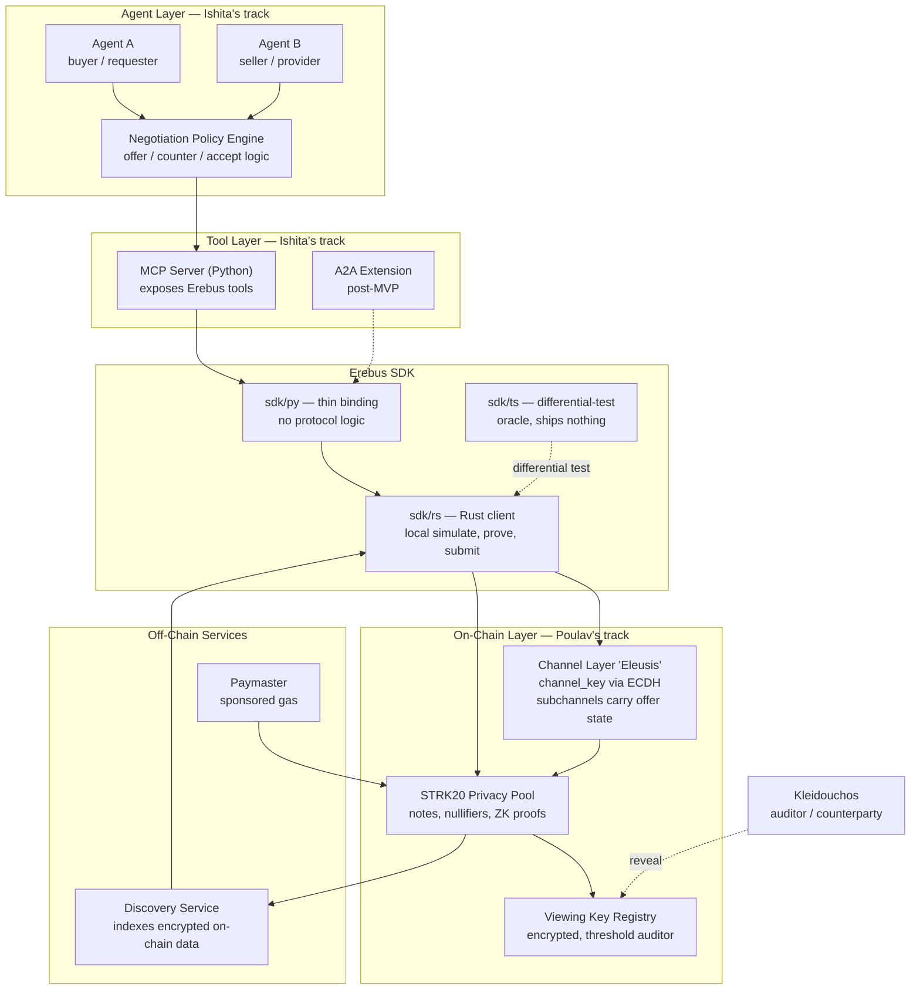
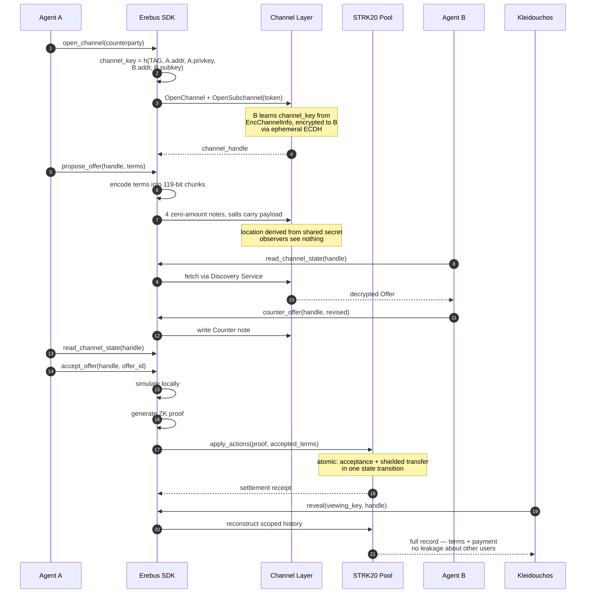
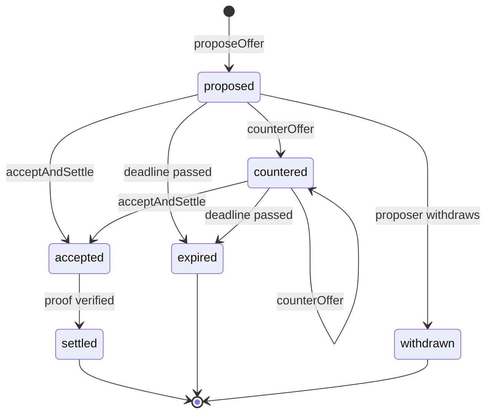

# Erebus — Architecture

> Scope note: this describes the **MVP** architecture. Anything marked *(post-MVP)* is deliberately out of scope for the first build.

---

## 1. System overview



**Reading it:** agents never touch the chain directly. They call tools. The SDK owns the simulate → prove → submit pipeline and all key handling. The channel layer and the pool are both on Starknet; the discovery service is the off-chain index that lets a client find its own notes without scanning the world.

**On the language boundary** — everything above `sdk/py` is Python, everything below it is
Rust. `sdk/py` carries no protocol logic: it marshals arguments across and returns results.
Key material stays inside `sdk/rs`, which makes constraint 6 in §5 a boundary the runtime
enforces rather than a rule people remember. `sdk/ts` is not in the call path at all.

**On `channel_key`** — a channel is **directional**, and the key is not a symmetric ECDH
secret. `compute_channel_key` is a hash over the *sender's private key* and the
recipient's public key, so only the sender can derive it. The recipient *receives* it, encrypted
under a separate ephemeral ECDH, via `EncChannelInfo.enc_channel_key` written on-chain by
`OpenChannel`. Two different mechanisms; do not conflate them. A→B and B→A are separate
channels with separate keys.

---

## 2. The happy path



---

## 3. Component responsibilities

| Component | Owner | Responsibility | MVP? |
|---|---|---|---|
| Channel layer | Poulav | `channel_key` derivation, subchannel writes, offer state transitions — **client-side, no Erebus Cairo**; the pool's own actions do the on-chain work | Yes |
| Settlement integration | Poulav | Bind accepted offer to shielded transfer in one action set; atomicity | Yes |
| Viewing key / disclosure | Poulav | Scoped reconstruction of a channel's record | Yes |
| Proof + submission pipeline | Poulav | simulate → prove → `apply_actions` | Yes |
| Erebus SDK (Rust) | Poulav | Primary client — action building, Cairo Serde, signing, proving, salt-lane codec. Sole holder of key material | Yes |
| `sdk/py` binding | Poulav + Ishita | Thin marshalling layer over `sdk/rs`. **No protocol logic** — if it grows a hash function, that is a bug | Yes |
| Erebus SDK (TS) | Shared | Differential-test oracle for the Rust port. **Ships nothing**, not in any call path | Yes |
| MCP Server (Python) | Ishita | Tool definitions callable by any agent framework | Yes |
| Negotiation policy engine | Ishita | When to offer, counter, accept, walk away | Yes |
| Reference agents | Ishita | Two agents running the loop autonomously | Yes |
| A2A extension | Shared | Register as an A2A skill | *(post-MVP)* |
| Free-text encrypted messaging | — | Prose chat between agents | *(post-MVP — see §7)* |
| Multi-party channels (>2) | — | N-way negotiation | *(post-MVP)* |

---

### Why Rust, and why the TS stays

`starkware-libs/starknet-privacy` ships a TypeScript SDK and a Rust `discovery-core`
crate. `discovery-core` covers the **read** side — hashes, storage slots, ECDH,
decryption, note discovery. There is no Rust **write** side anywhere: nothing builds
`ClientAction`s, serialises Cairo calldata, signs the invoke, or calls the proving
service. Erebus's Rust client fills that gap, and is useful beyond this project.

The invariants that matter here are exactly the kind a type system can hold: structured
salts belong only on zero-amount notes, actions must be phase-ordered, `tip` must be zero
in the proven transaction. In Rust those are unrepresentable rather than remembered.

The TypeScript implementation is **kept, not replaced.** There is no written spec for the
wire format — the reference is Cairo and their TS. Two independent implementations
agreeing on the same Cairo-emitted vectors is the strongest correctness signal available,
and it evaporates the moment one is deleted.

---

### Why Python above the SDK — *decided 2026-07-28*

The MCP server and the agents are Python. `mcp` (the official SDK, Anthropic-maintained)
supports stdio, SSE, and streamable HTTP, so nothing about MCP required TypeScript. This
puts Ishita in her own language and keeps the Rust client on the demo's critical path
rather than beside it.

What this decision explicitly does **not** rest on: reusing Ishita's prior x402 /
ERC-8004 work. That was checked and it does not transfer as code —

- **ERC-8004** is Draft and EVM-only (`eip155` namespace, EIP-155/712/721/1271). It has no
  Starknet form.
- **x402** has an official Python SDK, but its mechanisms are EVM, Solana, and TON.
  x402 *does* support Starknet — via SNIP-9 outside execution, in
  `NethermindEth/x402-starknet` — and that library is **TypeScript only**.

So there is no Python x402 path to Starknet and no TypeScript reuse worth having either,
since that library solves paying for HTTP APIs, not private settlement. Her experience
transfers as pattern, not code. The language choice therefore rests on the Erebus seam
alone.

*(Post-MVP, x402-on-Starknet and Erebus do compose — private negotiation, then x402 as the
HTTP payment trigger, same chain. Out of scope now.)*

### The Rust client is async — *decided 2026-07-28*

`sdk/rs` uses an async HTTP stack for the proving-service and RPC calls. Recorded here
because it constrains the seam below: PyO3 across an async boundary needs a runtime owned
on one side, whereas a subprocess CLI can keep the runtime entirely inside Rust and hand
Python plain JSON. Decide the seam knowing this, not around it.

### The Python ↔ Rust seam — **mechanism undecided**

The shape is settled; how the boundary is crossed is not. Two candidates:

| | How | Cost |
|---|---|---|
| **Subprocess** | `sdk/rs` grows an `erebus-cli` binary; JSON on stdin, JSON on stdout; Python shells out | No FFI, no build matrix. Process spawn per call — irrelevant against a ~29 s proof. Key material isolated by the OS |
| **PyO3 / maturin** | In-process native extension | Better ergonomics, no spawn. You own a wheel build per platform and a type conversion for every value crossing |

The surface is small either way — the seven `ErebusClient` methods in §4.

**This seam is the highest-risk item in the plan** and it belongs to neither track by
default, which is exactly why it gets missed. Build one method end-to-end early, with a
stub underneath, so the marshalling is proven before there is anything real to marshal.

---

## 4. Interface contract

This is the seam between the two tracks. **Agree this before writing code.** Ishita builds agents against a mock of exactly this; Poulav implements behind it. Neither blocks the other.

**This TypeScript block is normative**, and it is the one place that stays language-neutral
by convention: it is the declaration of the contract, not an implementation of it. Three
things mirror it and must not drift —
`sdk/ts/src/interface.ts` (the committed transcription), the Rust trait in `sdk/rs`, and
the Python surface exposed over the seam. If a signature changes here it changes in all
three, and it needs both owners (see CLAUDE.md, "The interface contract is frozen").

```typescript
// All names plain English. Brand vocabulary lives in docs, not the API.

type ChannelHandle = string;
type OfferId = string;

interface ErebusClient {
  // Establish a private channel with a counterparty.
  // Derives channel_key via ECDH; nothing observable on-chain links the parties.
  openChannel(counterparty: AgentId): Promise<ChannelHandle>;

  // Write a structured offer into the channel.
  proposeOffer(handle: ChannelHandle, terms: OfferTerms): Promise<OfferId>;

  // Write a counter-offer referencing a prior offer.
  counterOffer(handle: ChannelHandle, replyTo: OfferId, terms: OfferTerms): Promise<OfferId>;

  // Read all offer state visible to this party.
  readChannelState(handle: ChannelHandle): Promise<ChannelState>;

  // Accept an offer AND settle atomically. One state transition.
  acceptAndSettle(handle: ChannelHandle, offerId: OfferId): Promise<SettlementReceipt>;

  // Grant a viewing key to a third party (the Kleidouchos).
  grantViewingKey(handle: ChannelHandle, grantee: PublicKey): Promise<void>;

  // Reconstruct the scoped record using a viewing key.
  reveal(handle: ChannelHandle, viewingKey: ViewingKey): Promise<DisclosedRecord>;
}
```

### Data model

```typescript
interface OfferTerms {
  amount: bigint;            // token base units
  token: ContractAddress;    // ERC-20 address
  deadline: number;          // unix seconds
  memoHash: string;          // felt252 — hash of off-chain detail, not the detail itself
  nonce: number;             // replay protection
}

type OfferStatus =
  | "proposed"
  | "countered"
  | "accepted"
  | "expired"
  | "settled"
  | "withdrawn";

interface Offer {
  offerId: OfferId;
  channelId: ChannelHandle;
  proposer: AgentId;
  replyTo?: OfferId;
  terms: OfferTerms;
  status: OfferStatus;
  createdAt: number;
}

interface SettlementReceipt {
  offerId: OfferId;
  txHash: string;
  nullifiers: string[];
  provedAt: number;
}

interface DisclosedRecord {
  channelId: ChannelHandle;
  participants: AgentId[];
  offers: Offer[];
  settlement: SettlementReceipt;
}
```

### Offer state machine



Note that `accepted` and `settled` are separated only for observability — on-chain they are one atomic transition. If the proof fails, the acceptance never happened.

---

## 5. Hard technical constraints

These come from the audited `starkware-libs/starknet-privacy` implementation. Violating them produces either a broken build or a security hole.

1. **Never call `__execute__` on-chain.** The privacy pool is deployed as a Starknet account contract exposing `__validate__` and `__execute__` for *simulation*. The private key is embedded in the calldata. On-chain state changes go through `apply_actions` with a proof.

2. **The flow is always: simulate locally → generate proof → submit via `apply_actions`.** There is no shortcut.

3. **Note retrieval goes through the Discovery Service.** Do not write chain-scanning code. Notes live at shared-secret-derived locations; the whole point is that you find yours without scanning and nobody else can find them at all.

4. **Sequential indexing is enforced — no gaps.** Channel/subchannel note indices must be contiguous. This is what makes auditor tracing complete and prevents hidden transactions.

5. **Salt types are not uniform across encryption hash functions.** The audit flagged this as an integration risk and it was acknowledged, not resolved. Off-chain code that assumes one salt type will produce mismatched hashes and silently fail to locate notes. Verify against the source repo per call site.

6. **Agent keys never leave the SDK boundary.** The negotiation policy engine decides *what* to do; it never touches key material.

---

## 6. Trust and threat model

**What Erebus hides:** the existence of the channel, the participants, the terms, the amounts, the cadence of interaction.

**What Erebus does not hide:** that *someone* interacted with the pool at some time. Anonymity-set strength depends on total pool usage — which is currently small, since STRK20 shipped June 2026. Be honest about this in any pitch.

**Trust assumptions:**
- The threshold auditor system holds the encrypted viewing keys. This is a deliberate compliance tradeoff, not a bug — but it is a trust assumption and should be stated plainly.
- The Discovery Service is an availability dependency. It cannot read note contents, but if it is down, clients cannot find their notes.
- **The proving service sees the viewing key.** The transaction it proves carries
  `[user_addr, viewing_key, ...actions]` as calldata, so the operator can decrypt that
  user's note amounts and see their channel structure. It *cannot* spend — the invocation
  is signed by the user's account over that exact calldata, so it cannot forge a different
  action set. This is a confidentiality exposure, not a theft vector, and it is what OHTTP
  is for: the relay learns who is asking, the gateway learns what is asked, neither learns
  both. Self-hosting the prover removes the assumption entirely.
- **Deposits depend on the screening service.** The live pool has a non-zero screener key,
  so shielding requires a screener-signed attestation fresh within 300 s. Note-to-note
  transfers are unaffected.
- Soundness rests on STRK20's proof system and the OpenZeppelin-audited contracts. Erebus inherits their security; it does not add to it.

---

## 7. The "messaging" nuance — read this before pitching

The channel primitive is designed to carry **notes** — encrypted transaction state — not arbitrary free-text messages.

In the MVP, "negotiation" means **structured state transitions** (`Offer`, `Counter`, `Accept`) written into subchannels. That is sufficient for commercial negotiation and is genuinely novel as agent infrastructure.

**How, concretely** — this is narrower than the sentence above implies, and the detail
matters. A note has no payload field. Its only client-writable space is the salt, capped
at `2 ≤ salt < 2^120`. We therefore:

- pin bit 119 to `1` and carry payload in bits 0–118 — **119 usable bits per note**, and
  every salt stays in the contract's valid range;
- compress `OfferTerms` to **320 bits** (`token` is implied by the subchannel, `nonce` by
  the note index, `memoHash` truncated to 128 bits) — **400 bits** with framing (type 8,
  `replyTo` 32, `createdAt` 40);
- write each message as a fixed run of **4 zero-amount notes** at consecutive indices, all
  in **one action set and one proof**. 400 bits against 4 × 119 = 476 capacity; 3 notes
  would be 357 and does not fit.

Zero-amount notes move no value and need no deposit, so they are pure data carriers. They
are also permanently unspendable, so each burns a subchannel index for good.

One rule this creates: **structured salts on data notes, random salts on value notes.**
The salt is the one-time-pad nonce for the encrypted amount, so reusing a mask across two
differing amounts would leak their difference. Zero-amount notes have no variance and are
immune; the settlement note must keep its random salt, and the accept-commitment therefore
lives in its own data note within the same action set.

### It could carry prose. It shouldn't. — *revised 2026-07-26*

An earlier version of this section claimed the primitive simply cannot carry arbitrary
messages. That was wrong, and we disproved it ourselves: **the salt lane is
content-agnostic.** Nothing about it cares whether the bits are an `OfferTerms` or ASCII.
We use 400 bits because that is what an offer needs, not because it is a ceiling — notes
are unbounded in count, so you could write as many as you like.

Do not repeat the "it's impossible" claim. Someone will call it, correctly. The real
argument is cost:

| | |
|---|---|
| Payload per note | 119 bits (~15 bytes) |
| Cost per note | one permanent storage felt, one event, **one subchannel index burned forever** |
| A 280-character message | ~2,240 bits → **19 notes**, 19 dead slots |
| Latency | ~29 s per round (one proof), regardless of note count |
| Bidirectional | channels are directional — chat needs two channels and two subchannels |
| Reclaim | none. `use_note` rejects zero amounts, so data notes can never be nullified |

You are paying one permanent storage slot per fifteen bytes, in a privacy pool, forever.
It works. It is the most expensive messaging medium you could build.

So: **structured state transitions are what fits the cost envelope.** Prose chat would be
an off-chain layer keyed off the same shared secret — honest further work, not something
STRK20 gives us free.

**Action:** confirm this framing with StarkWare early. If their mental model is literal
encrypted chat, correct it before the demo, not during it — and make the *economic*
argument, not the impossibility one.

---

## 8. Open questions

Answered 2026-07-25 — evidence in [docs/friction.md](./docs/friction.md).

- [x] **Which network?** **Sepolia.** Pool v2.0 live at `0x0254a6…0d91`, verified on-chain
  (`get_version()` = `'2.0'`, `proof_validity_blocks` = 450, fee = 0). Mainnet has no
  deployment — upstream's mainnet env file is entirely `TODO_` placeholders. (F4)
- [x] **Proof generation time?** **~29 s per transaction** (vendor figure, 12-core/46 GiB).
  Per *transaction*, so notes batch — but each negotiation round is its own proof. (F7)
- [x] **Can subchannel writes carry arbitrary structured payloads?** **Not in a payload
  field — there isn't one.** A note is `(packed_value: felt252, token: ContractAddress)`
  and `ClientAction` has no payload variant. But the note salt is client-chosen and
  round-trips verbatim, giving 119 usable bits per note, and notes are unbounded in count.
  So arbitrary payloads *are* carryable by fragmentation, at one permanently-burned
  storage slot per 15 bytes. We use 4 notes per offer; see §7. (F1)
- [ ] Does the paymaster path work for an agent with zero public balance end-to-end?
  STRK20 ships no paymaster; the demo wires third-party AVNU. Pool fee is 0, so this is
  ordinary tx gas. (F4)
- [~] **How should agent identity map to Starknet accounts?** *Direction set 2026-07-28,
  not needed for the MVP.* Agents arrive with their own Starknet account; Erebus creates
  the **pool identity key** and the channels for them, and takes a **scoped session key**
  via account abstraction to produce the account signature. Three things that decision
  carries:
  - **The pool key is not the custody boundary — the session key is.** Spending needs both
    `user_private_key` *and* an account signature (`privacy.cairo:207`). Holding the pool
    key alone cannot move funds. Once Erebus can also sign for the account, it holds both
    halves, and the session key's scope is the only remaining limit.
  - **"Agents bring their own wallet" has an asterisk.** Session keys are an account-contract
    feature, not a Starknet guarantee — Argent and Braavos have them, a plain OZ account
    does not. The pool is agnostic (all three routes in `assert_valid_signature` delegate to
    the agent's own account), so the agent's wallet choice decides whether this works.
  - **Pool-key loss is unrecoverable.** Identity derives from it
    (`hashes.cairo:56-60`). StarkWare's *Enclave* project — "trusted operators securely
    store offchain secrets, such as STRK20 viewing keys" — is the obvious candidate rather
    than building custody ourselves.

  **Not an MVP blocker.** The demo provisions both agents itself and holds both accounts
  and both pool keys; no session key is involved. This is post-green-light product shape.
  The judgment still to write: whether Erebus custodying agent keys is acceptable for what
  this is meant to be.

Still open, and not on the original list:

- [x] **No public Sepolia proving-service endpoint.** Without a proof, `apply_actions`
  reverts. **Resolved 2026-07-28: none exists, and StarkWare's own recommendation is to
  self-host prover + Pathfinder.** A setup cost, not an external dependency. (F5)
- [ ] **The deployed pool is a newer build than the README's contracts table.** Its ABI
  includes `ComputeAndInvoke`, which `PRIVACY-0.14.3-RC.0` lacks. Which prover/discovery
  versions match it? (F4)
- [ ] **Shielding requires a screening attestation** — and this is now the only hard
  external dependency left. The live pool has a non-zero screener key, so any action set
  with a deposit needs a screener signature fresh within 300 s. Self-hosting does *not*
  supply it: `proof-interceptor` relays a signature from elliptic-proxy, it does not
  produce one. Either StarkWare grant screening access, or we deploy our own pool instance
  with a screener key we hold. Only the deposit leg is gated. (F6)