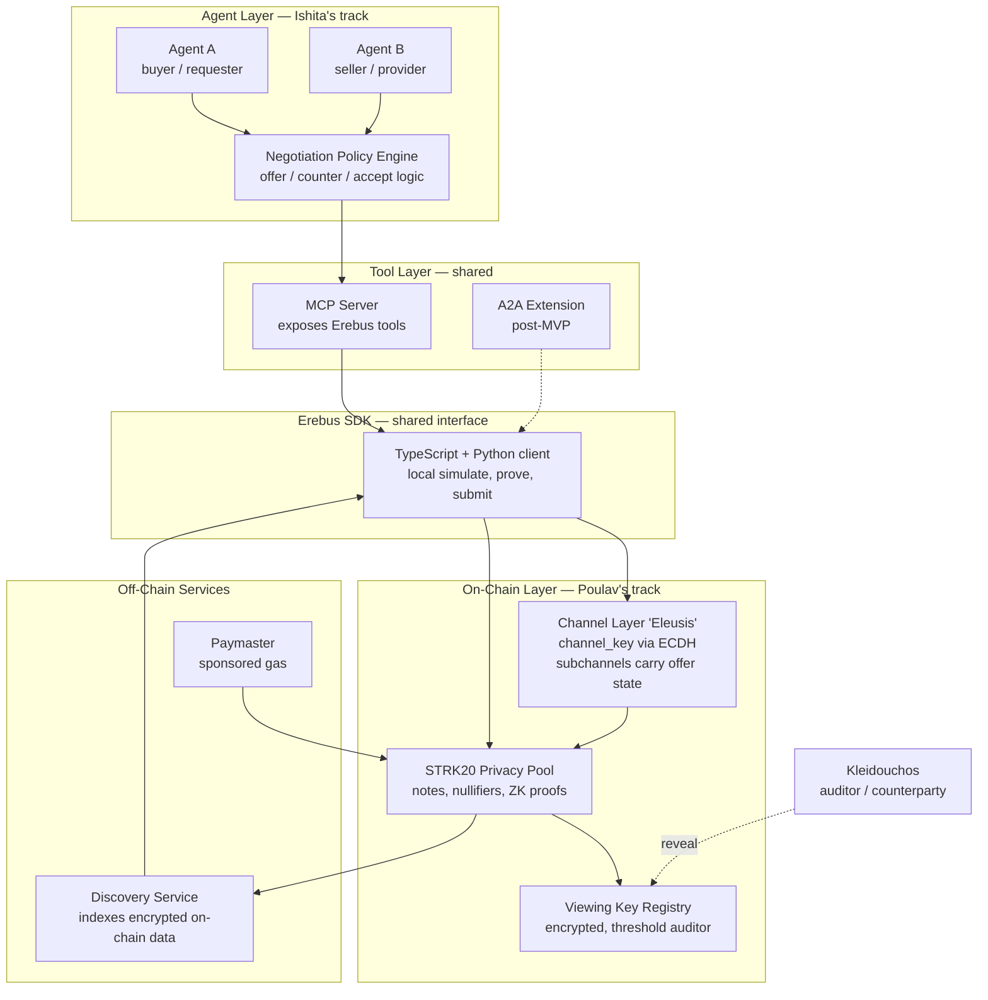
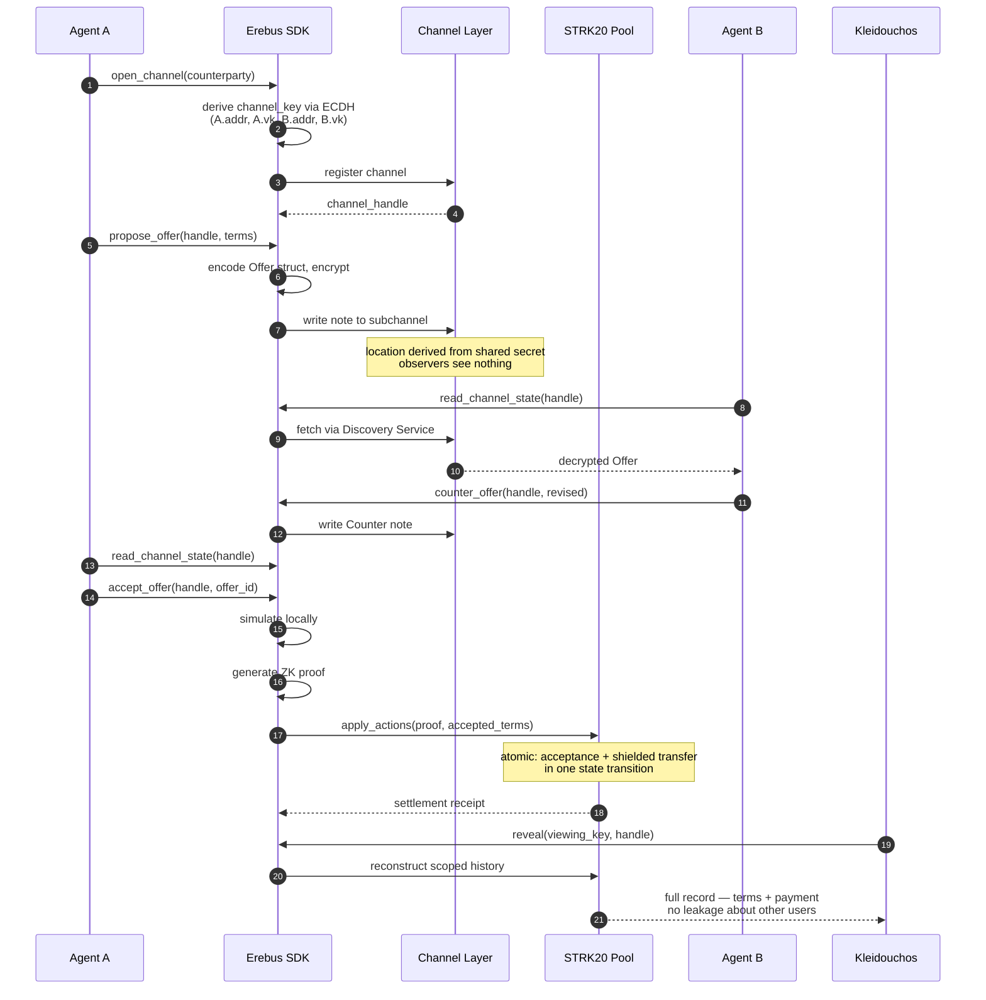
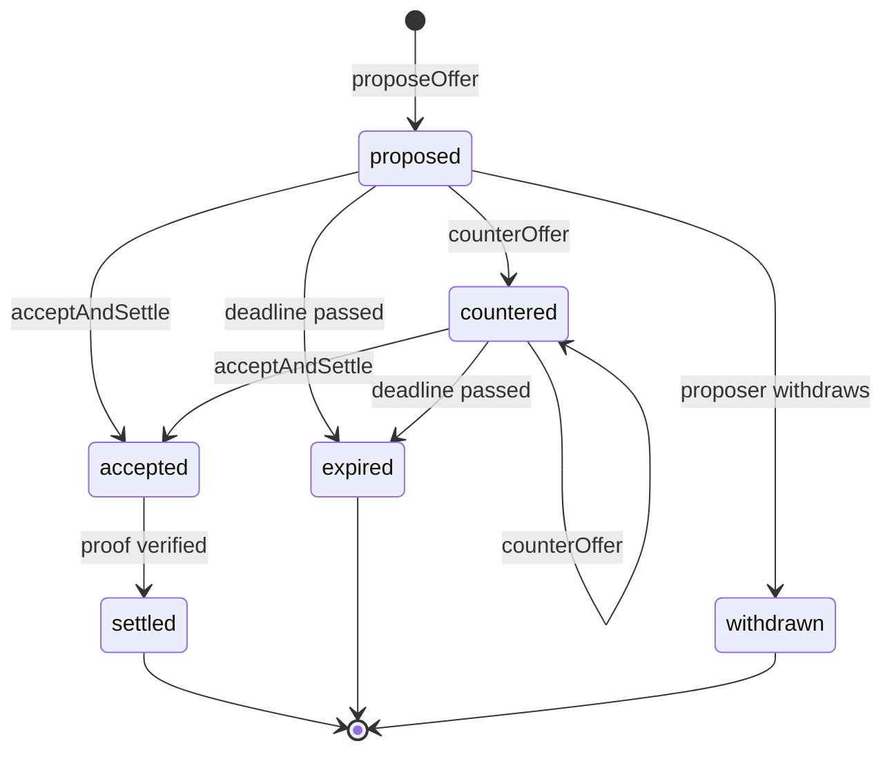

# Erebus — Architecture

> Scope note: this describes the **MVP** architecture. Anything marked *(post-MVP)* is deliberately out of scope for the first build.

---

## 1. System overview



**Reading it:** agents never touch the chain directly. They call tools. The SDK owns the simulate → prove → submit pipeline and all key handling. The channel layer and the pool are both on Starknet; the discovery service is the off-chain index that lets a client find its own notes without scanning the world.

---

## 2. The happy path



---

## 3. Component responsibilities

| Component | Owner | Responsibility | MVP? |
|---|---|---|---|
| Channel Layer (Cairo) | Poulav | `channel_key` derivation, subchannel writes, offer state transitions | Yes |
| Settlement integration (Cairo) | Poulav | Bind accepted offer to shielded transfer; atomicity | Yes |
| Viewing key / disclosure | Poulav | Scoped reconstruction of a channel's record | Yes |
| Proof + submission pipeline | Poulav | simulate → prove → `apply_actions` | Yes |
| Erebus SDK (TS) | Shared | Client-side interface, key handling, encoding | Yes |
| Erebus SDK (Python) | Ishita | Python binding for agent frameworks | Yes |
| MCP Server | Ishita | Tool definitions callable by any agent framework | Yes |
| Negotiation policy engine | Ishita | When to offer, counter, accept, walk away | Yes |
| Reference agents | Ishita | Two agents running the loop autonomously | Yes |
| A2A extension | Shared | Register as an A2A skill | *(post-MVP)* |
| Free-text encrypted messaging | — | Prose chat between agents | *(post-MVP — see §7)* |
| Multi-party channels (>2) | — | N-way negotiation | *(post-MVP)* |

---

## 4. Interface contract

This is the seam between the two tracks. **Agree this before writing code.** Ishita builds agents against a mock of exactly this; Poulav implements behind it. Neither blocks the other.

```typescript
// All names plain English. Brand vocabulary lives in docs, not the API.

type ChannelHandle = string;
type OfferId = string;

interface ErebusClient {
  // Establish a private channel with a counterparty.
  // Derives channel_key via ECDH; nothing observable on-chain links the parties.
  openChannel(counterparty: AgentId): Promise<ChannelHandle>;

  // Write a structured offer into the channel.
  proposeOffer(handle: ChannelHandle, terms: OfferTerms): Promise<OfferId>;

  // Write a counter-offer referencing a prior offer.
  counterOffer(handle: ChannelHandle, replyTo: OfferId, terms: OfferTerms): Promise<OfferId>;

  // Read all offer state visible to this party.
  readChannelState(handle: ChannelHandle): Promise<ChannelState>;

  // Accept an offer AND settle atomically. One state transition.
  acceptAndSettle(handle: ChannelHandle, offerId: OfferId): Promise<SettlementReceipt>;

  // Grant a viewing key to a third party (the Kleidouchos).
  grantViewingKey(handle: ChannelHandle, grantee: PublicKey): Promise<void>;

  // Reconstruct the scoped record using a viewing key.
  reveal(handle: ChannelHandle, viewingKey: ViewingKey): Promise<DisclosedRecord>;
}
```

### Data model

```typescript
interface OfferTerms {
  amount: bigint;            // token base units
  token: ContractAddress;    // ERC-20 address
  deadline: number;          // unix seconds
  memoHash: string;          // felt252 — hash of off-chain detail, not the detail itself
  nonce: number;             // replay protection
}

type OfferStatus =
  | "proposed"
  | "countered"
  | "accepted"
  | "expired"
  | "settled"
  | "withdrawn";

interface Offer {
  offerId: OfferId;
  channelId: ChannelHandle;
  proposer: AgentId;
  replyTo?: OfferId;
  terms: OfferTerms;
  status: OfferStatus;
  createdAt: number;
}

interface SettlementReceipt {
  offerId: OfferId;
  txHash: string;
  nullifiers: string[];
  provedAt: number;
}

interface DisclosedRecord {
  channelId: ChannelHandle;
  participants: AgentId[];
  offers: Offer[];
  settlement: SettlementReceipt;
}
```

### Offer state machine



Note that `accepted` and `settled` are separated only for observability — on-chain they are one atomic transition. If the proof fails, the acceptance never happened.

---

## 5. Hard technical constraints

These come from the audited `starkware-libs/starknet-privacy` implementation. Violating them produces either a broken build or a security hole.

1. **Never call `__execute__` on-chain.** The privacy pool is deployed as a Starknet account contract exposing `__validate__` and `__execute__` for *simulation*. The private key is embedded in the calldata. On-chain state changes go through `apply_actions` with a proof.

2. **The flow is always: simulate locally → generate proof → submit via `apply_actions`.** There is no shortcut.

3. **Note retrieval goes through the Discovery Service.** Do not write chain-scanning code. Notes live at shared-secret-derived locations; the whole point is that you find yours without scanning and nobody else can find them at all.

4. **Sequential indexing is enforced — no gaps.** Channel/subchannel note indices must be contiguous. This is what makes auditor tracing complete and prevents hidden transactions.

5. **Salt types are not uniform across encryption hash functions.** The audit flagged this as an integration risk and it was acknowledged, not resolved. Off-chain code that assumes one salt type will produce mismatched hashes and silently fail to locate notes. Verify against the source repo per call site.

6. **Agent keys never leave the SDK boundary.** The negotiation policy engine decides *what* to do; it never touches key material.

---

## 6. Trust and threat model

**What Erebus hides:** the existence of the channel, the participants, the terms, the amounts, the cadence of interaction.

**What Erebus does not hide:** that *someone* interacted with the pool at some time. Anonymity-set strength depends on total pool usage — which is currently small, since STRK20 shipped June 2026. Be honest about this in any pitch.

**Trust assumptions:**
- The threshold auditor system holds the encrypted viewing keys. This is a deliberate compliance tradeoff, not a bug — but it is a trust assumption and should be stated plainly.
- The Discovery Service is an availability dependency. It cannot read note contents, but if it is down, clients cannot find their notes.
- Soundness rests on STRK20's proof system and the OpenZeppelin-audited contracts. Erebus inherits their security; it does not add to it.

---

## 7. The "messaging" nuance — read this before pitching

The channel primitive is designed to carry **notes** — encrypted transaction state — not arbitrary free-text messages.

In the MVP, "negotiation" means **structured state transitions** (`Offer`, `Counter`, `Accept`) written into subchannels. That is sufficient for commercial negotiation and is genuinely novel as agent infrastructure.

It is **not** a general-purpose encrypted messenger. If prose messaging between agents is wanted, that is an additional layer — likely an off-chain transport keyed off the same `channel_key` — and it is honest to describe it as further work rather than something STRK20 gives us free.

**Action:** confirm this framing with StarkWare early. If their mental model is literal encrypted chat, correct it before the demo, not during it.

---

## 8. Open questions

- [ ] Which network has the full pool + discovery service stable — Sepolia or mainnet? Verify before building.
- [ ] What is realistic client-side proof generation time per action? Measure early; it determines whether multi-round negotiation feels usable.
- [ ] Can subchannel writes carry arbitrary structured payloads cleanly, or does the SDK force a payment-shaped envelope? This is the highest-uncertainty technical question in the whole build.
- [ ] Does the paymaster path work for an agent with zero public balance end-to-end?
- [ ] How should agent identity map to Starknet accounts — one account per agent, or per channel?