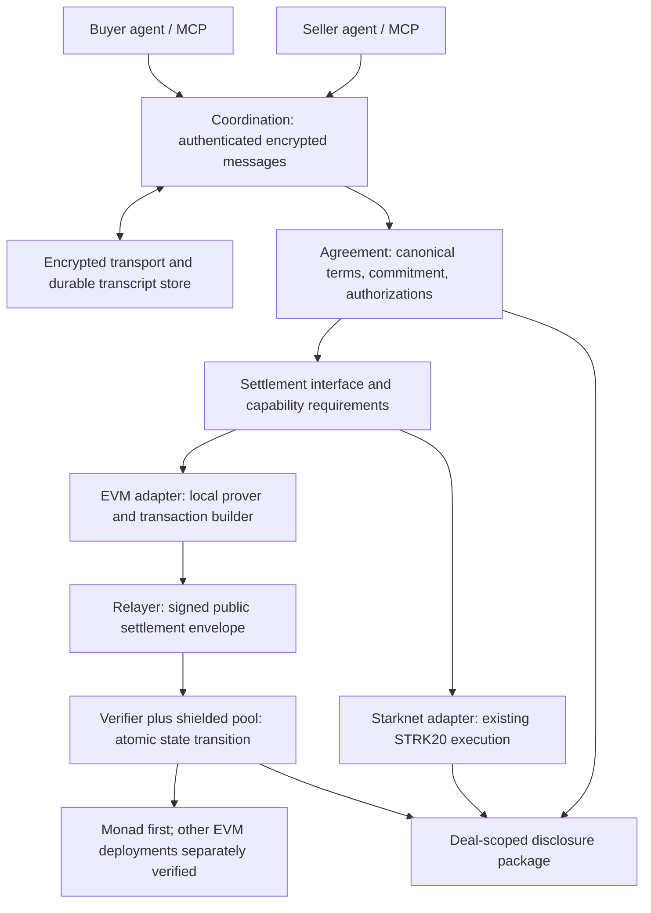
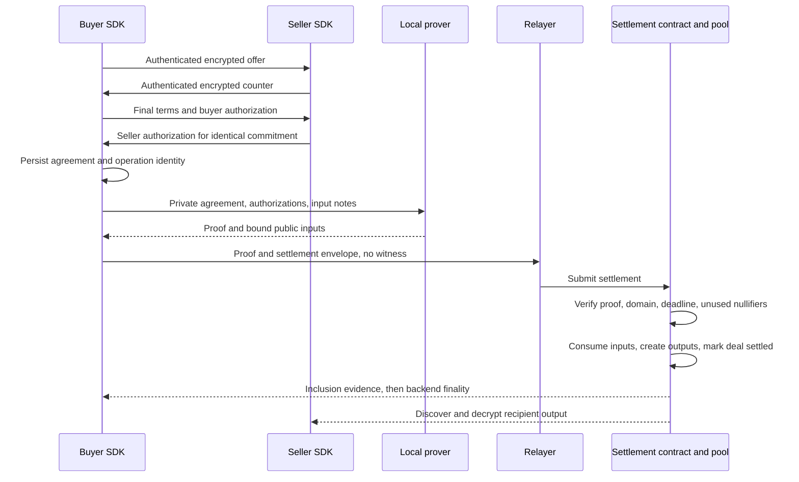

# Erebus Metropolis Architecture

Implementation order and completion criteria: [Metropolis roadmap](metropolis-roadmap.md).

## 1. Goal and current boundary

Erebus owns private negotiation and agreement semantics. Each settlement backend enforces its declared guarantees on one chain.
Portability means shared semantics and test vectors. It does not mean identical proofs, keys, addresses, or privacy across chains.
Cross-chain settlement and bridging are outside this design.

The current implementation combines encrypted acceptance and shielded payment in one STRK20 action set.
Their amount equality is a Rust check, not an Erebus predicate enforced by the STRK20 proof.
The new target adds that enforcement to the settlement verifier.

Settlement is selected, not branched on. A session configuration names a chain family
(Starknet or EVM) and a chain instance, and thereby one settlement backend. The core must not
carry per-chain conditionals; interactions are phrased as "settle this accepted deal under
these guarantees", never "if Starknet do X, if EVM do Y". Chain family describes how a backend
reaches a chain, not how privacy works there. Monad, Base, and Ethereum are one EVM family with
different chain IDs, RPCs, and deployments, so a `MonadSettlementBackend` is a warning sign and
an `EvmSettlementBackend` configured for Monad is the target.

Three cryptographic jobs are separable and must not be conflated:

| Job | Mechanism | Proof required |
|---|---|---|
| Negotiation confidentiality | Authenticated encryption and key agreement | No |
| Agreement authorization | Signatures, or a proof when signer identity must stay hidden | Only to hide the signer |
| Private settlement | The backend's privacy mechanism | Only for the shielded guarantee |

The planned shielded EVM backend requires zero-knowledge proofs. Other privacy mechanisms need their own trust and capability declarations.
The core therefore must not assume that every backend generates a proof. A backend declares the
guarantees it provides; a TEE attestation or a native private rollup could satisfy the same
interface without one. Coupling the core to proofs would re-couple Erebus to one privacy
technology, just at a different layer.

| Read first | What the source establishes |
|---|---|
| [`channel.rs`](../sdk/rs/src/channel.rs), `accept_and_settle_with_change` | Builds the atomic action set and rejects unequal amounts locally |
| [`negotiation.rs`](../sdk/rs/src/negotiation.rs), `OfferBook` | Enforces acceptance and expiry rules on the client |
| [`client.rs`](../sdk/rs/src/client.rs), `accept_and_settle` | Joins negotiation, note selection, durable operations, and execution |
| [`execution.rs`](../sdk/rs/src/execution.rs) | Runs the Starknet compile, prove, and submission path |
| [`disclosure.rs`](../sdk/rs/src/disclosure.rs) | Packages deal keys and STRK20 note capabilities |
| [`Cargo.toml`](../sdk/rs/Cargo.toml) | Identifies current Stark-curve and wire encryption dependencies |

Before extraction, explain which checks a caller can bypass through direct contract calls.
Use that answer to distinguish SDK policy from settlement guarantees.
The historical [architecture](../ARCHITECTURE.md) provides context. Current source takes precedence where they differ.

## 2. Components



Coordination controls message order, offer references, authentication, and durable storage.
Agreement defines exactly what each participant authorizes.
Settlement controls funds, proof construction, submission, finality, and recovery.
The adapter receives a final agreement. It does not decide whether to counter an offer.

Two boundaries need exact names. The settlement coordinator is offchain SDK logic: it reads an
already-selected settlement context, validates the agreement, prepares the backend-specific
transition, requests proof or signature material, submits, and normalizes the result into one
receipt. It is not a contract, and it does not choose the chain. The settlement contract is the
narrow onchain half: verify evidence, reject replay, execute or authorize payment, update
state. Chain selection happens when the session is configured, before negotiation, from the
settlement options a seller advertises. The deal's chain is fixed once Eleusis opens;
negotiating the chain itself is out of scope for this design.

Chain interaction and privacy mechanism are separate axes. The EVM chain adapter owns RPC,
chain ID, nonces, and submission. A privacy backend owns how funds move privately. One EVM
adapter can front a public-bound settlement, an Erebus pool, or a third-party privacy rail;
those deployments differ in backend, not in adapter.

Offchain Eleusis transport is new work. Existing STRK20 note transport cannot become a network transport through a configuration change.
Start with explicit peer keys and endpoints. Discovery and identity registries remain separate integration decisions.
The new discovery and negotiation protocol does not require chain transactions. Funding, settlement, receipt verification, and note discovery use chain access.
The existing STRK20 channel transport remains onchain until a separate migration is implemented.

## 3. One deal, end to end



Funding happens before this flow and can expose the deposit amount and account.
No separate onchain commitment transaction is required by this draft.
Both authorizations permit settlement. They do not guarantee submission or service delivery.
A backend that requires no proof omits the prover step; the coordinator submits the authorized
transition directly. This diagram shows the shielded path.

## 4. Agreement representation

The following fields are conceptual. Freeze the byte encoding and cryptographic suite before implementation.

```text
Deal D = {
  protocol_version, suite_id,
  domain: {chain_namespace, chain_id, settlement_contract, pool, verifier_version},
  deal_id, revision, transcript_root,
  buyer_authorization_key, seller_authorization_key,
  recipient_note_key, asset_identifier, amount_base_units,
  expiry, terms_digest, fee_policy,
  settlement_nonce
}
Cdeal = Commit("EREBUS_DEAL_V1", Encode(D), random_blinding)
Authorization = Sign(role_tag, domain, Cdeal)
```

Use fresh cryptographic randomness for the blinding value. A hash of predictable prices and addresses alone does not hide terms.
Specify lengths, field order, integer bounds, endianness, and address namespaces. Reject ambiguous encodings and field reductions.
Both participants verify the opening before authorization. The seller verifies that the recipient note key belongs to it.
Bind relayer fees and any recipient restrictions into the authorized fee policy.

Messages need a session ID, deal ID, revision, author, sequence, parent hash, type, and authenticated payload.
The final transcript root commits to the agreed transcript. It does not prove that every unshared message exists or that business claims are true.
Authenticating a shared encryption key alone cannot establish which participant authored a message to an auditor.
Choose a signature scheme for independently verifiable authorship where disclosure requires it.
There must be exactly one deterministic encoding: both participants must compute the same
commitment from the same terms. Any representation ambiguity — decimals, base units, address
namespace, field order — is a protocol bug that silently forks the agreement.

## 5. The settlement statement

The verifier must enforce the following relation, including the pool transition:

```text
Public inputs:
  domain, Cdeal, Ndeal, accepted_input_root,
  input_note_nullifiers, output_note_commitments,
  output_ciphertext_digest, expiry, authorized_public_fee_fields

Private witness:
  D, commitment_blinding, both authorizations,
  input notes, ownership secrets, membership paths,
  recipient and change output openings, encryption witness as required

Constraints:
  commitment opens to D
  both role-specific authorizations verify against D's keys and Cdeal
  D.domain and D.expiry equal the corresponding public inputs
  each input exists and the spender controls it
  payment.asset == D.asset and payment.amount == D.amount
  payment.recipient == D.recipient_note_key
  inputs == payment + change + authorized fees, per asset
  all amounts satisfy range constraints
  output commitments and recoverable ciphertexts describe those outputs
  Ndeal derives from the unique authorized settlement identity
```

The contract verifies the live chain and deployment domain, timestamp against expiry, accepted root, and unused nullifiers.
It consumes note nullifiers and the deal nullifier, then inserts outputs in the same transaction.
Any failed step reverts the entire transition.
Publishing expiry leaks expiry. A hidden expiry requires an additional proof design that binds the comparison to chain time.

An agreement proof and a pool proof cannot be unrelated valid proofs.
They must share constrained payment commitments and transaction context, and execute atomically.
A combined circuit or a supported pool verification hook can provide this binding. The choice is unresolved.
Binding a ciphertext digest alone does not prove decryptability. Define encryption correctness constraints or a recipient acknowledgment protocol.

M0 selects one consumption identity across every signed revision of a deal, as specified in D02 of the decision record.
Derive it from the deployment domain, buyer identity, and a fixed random settlement nonce authorized in every revision.
Do not let the prover choose a new nonce for each settlement attempt.
The first valid revision to settle consumes the deal. A counteroffer does not revoke earlier signed permission.
Pool note nullifiers prevent double spending but do not prevent repeat payment from different notes.

## 6. Backend contract and migration

Define behavior before choosing Rust trait syntax:

| Operation | Required behavior |
|---|---|
| `capabilities()` | Declare privacy, agreement enforcement, authorization, and finality support |
| `prepare(agreement, operation_id)` | Persist canonical intent and create a backend-specific prepared settlement |
| Backend-internal evidence preparation | Produce signatures or proofs as required. No public `prove` method is mandatory in the common interface |
| `submit(prepared)` | Submit the same authorized transition and record its transaction identity |
| `status(operation_id)` | Return unknown, pending, included, finalized, reverted, or expired |
| `verify(receipt)` | Verify domain, agreement binding, state transition, and chain evidence |

Keep funding and withdrawal as explicit wallet operations. Negotiation must not silently authorize either.
Core types must not assume a Starknet `Felt`, EVM address, proof system, or transaction format.
A receipt includes domain, commitment, nullifier, transaction and block identifiers, finality state, and the verified guarantee set.
The caller rejects a backend that lacks a required guarantee. Never silently downgrade to public settlement.

The interface declares guarantees; it does not mandate proofs. Candidate backends include a
Starknet STRK20 adapter, an EVM public-bound / x402 adapter, an EVM shielded pool, a TEE
attestation backend, and a private rollup. The required guarantees — hidden amount, hidden
recipient, atomic binding, scoped disclosure — select a compatible backend. Ordinary public
ERC-20 settlement cannot satisfy hidden amount and recipient and must not be chosen for a deal
that requires them.

Two EVM milestones are distinct. V1 binds a publicly visible settlement to the accepted deal
through signatures and contract state; it preserves negotiation privacy but not settlement
privacy. V2 hides amount and recipient behind a proof and is the analogue of the STRK20
backend. V1 exercises the coordinator and backend boundary; it does not satisfy the shielded
guarantee and must not be presented as though it does.

Proposed lifecycle: `Negotiating -> Authorized -> Prepared -> Submitted -> Included -> Finalized`.
`Unknown` requires reconciliation, not a fresh payment. Reorgs can return included transactions to pending or unknown.
An expired unsubmitted agreement cannot settle. A local timeout does not prove that an already submitted transaction failed.

Keep existing STRK20 codecs and execution behind its adapter.
Extract shared semantics only after tests describe their current behavior.
The existing backend must report its client-enforced agreement checks honestly.
Full proof-enforced parity on Starknet requires further backend work and is not implied by this interface.

## 7. Decisions for the implementer

Record your choice, reasoning, and evidence for each item before building the dependent component.

| Decision | Evidence needed |
|---|---|
| EVM privacy pool and integration hook | Small private transfer with enforceable agreement binding |
| Circuit, commitment hash, and authorization scheme | Rust/circuit vectors, proof timing, verifier cost, reviewable dependencies |
| Deal-wide replay rule (M0 D02) | Tests with two signed revisions and different funding notes |
| Transport and key establishment | Peer authentication, nonce rules, crash recovery, metadata exposure |
| Output delivery and encryption | Seller recovers spendable payment after buyer disconnects |
| Disclosure storage and retention | Auditor reconstructs the deal after the relay loses its copy |
| x402 integration | Defined scheme and receipt verification without a second payment |
| Chain selection model | Recommended: fixed at session creation before negotiation; negotiating the chain itself is out of scope |
| EVM milestone (M0 D01) | V1 is intermediate. V2 shielded is required for the final product demo |
| Backend selection by guarantee | A required guarantee that a backend cannot provide must fail, not silently downgrade |

EIP-712 provides EVM typed signing, but no replay protection. Public signature recovery also reveals the signer.
Private authorization needs a compatible proof design; EIP-712 alone does not provide it. See [EIP-712](https://eips.ethereum.org/EIPS/eip-712).
Use established encryption implementations. [HPKE](https://www.rfc-editor.org/rfc/rfc9180) is a candidate building block, not a complete session protocol.
x402 composition requires an explicitly supported payment scheme and resource-server integration.
The resource server controls access issuance. There must be exactly one payment, and payment finality does not prove service delivery.

M0 defaults and implementation gates are recorded in the [decision record](metropolis-decisions.md).
