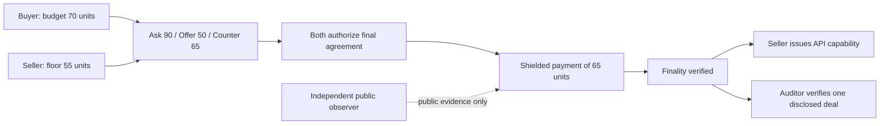

# Erebus Metropolis Demo Plan

Status: implementation plan, 2026-09-14. Work belongs on `metropolis`.
Read the [architecture](metropolis-architecture.md) and [threat model](metropolis-threat-model.md) before implementation.
Use the [implementation roadmap](metropolis-roadmap.md) for dependencies, sequencing, and progress.

## 1. What the demo establishes

Two agents negotiate a service price privately, authorize the same agreement, and execute a matching shielded payment on Monad.
An auditor receives evidence for exactly one deal.
The seller releases an API capability after final settlement. This delivery remains a seller-controlled application action.

Use one service and one supported asset. Start with deterministic agent policies for reproducibility.
Add an LLM only after the protocol flow passes the same tests.
Amounts below are scripted test values, not market quotes or production activity.

The settlement chain and privacy mode are chosen before the Eleusis opens, from the options the
seller advertises. Once the channel is open the deal's chain is fixed; negotiating the chain
itself is out of scope for Metropolis. Choosing the chain earlier is deliberate: it keeps the
coordinator from deciding on the fly and keeps negotiation chain-independent.

A public-bound EVM settlement (V1) exercises the coordinator and backend boundary but does not
satisfy this demo's gate. A public transfer can demonstrate amount and recipient binding,
but cannot demonstrate their confidentiality. If V1 is demonstrated, record it as an
architecture milestone, not as a passing Stage 1.

## 2. Build in measurable stages

Stages are dependencies, not calendar estimates. Record decisions before moving to dependent work.

| Stage | Deliverable | Exit condition |
|---|---|---|
| 0: Source map | Identify shared semantics and STRK20 dependencies | Explain the current SDK checks and contract guarantees in your own words |
| 1: Settlement feasibility | Minimal EVM shielded transfer bound to an agreement | Amount or recipient substitution fails through direct contract calls |
| 2: Agreement specification | Encoding, domains, authorizations, nullifier rule | Rust and proof implementation agree on valid and invalid vectors |
| 3: Private coordination | Authenticated messages, transcript storage, restart behavior | Two processes agree on one transcript root after retry and restart |
| 4: Monad integration | Local proof, relayed submission, note discovery, receipt verification | Seller recovers payment; replay fails; lost-response recovery succeeds |
| 5: Disclosure | Recipient-bound package and standalone verification | Auditor verifies this deal but cannot decrypt a second deal |
| 6: Service demo | API capability issued for finalized agreement | One successful paid request, observer report, and reproducible evidence bundle |
| 7: Regression and rehearsal | Existing Starknet tests and timed demo | No silent guarantee downgrade; all displayed claims match collected evidence |

Stage 1 is the architecture gate. If the pool cannot enforce agreement binding, resolve that before broader SDK extraction.
Do not count an encrypted negotiation plus a public transfer as passing this gate.
A mock can exercise orchestration, but cannot pass a chain verification gate.

## 3. Ninety-second recording

| Time | Show | Evidence |
|---|---|---|
| 0-15s | Buyer and seller policies, then private negotiation | Operator-authorized terminal view, separate from observer |
| 15-30s | Agreement authorization and settlement preparation | Matching commitment in both participant records |
| 30-45s | Public transaction and observer output | Actual calldata, logs, commitments, and explicit visible metadata |
| 45-60s | Final settlement and successful API request | Seller note discovery, finalized receipt, capability use |
| 60-75s | One-deal auditor disclosure | Verified opening, authorizations, accepted and paid amounts |
| 75-90s | Failed replay and denied adjacent-deal access | Contract rejection and disclosure failure |

Measure the actual end-to-end duration before recording.
If proof generation exceeds the recording window, label the time skip and show the measured duration.
Do not present chain inclusion time as proof-generation or full-deal latency.

The observer must run without participant keys, transcript files, or auditor grants.
Show public funding separately so the audience can see the correlation boundary.
The private operator display intentionally reveals terms to the audience; it is not the observer's data source.

## 4. x402 boundary

x402 is a payment and fulfilment mechanism beneath an EVM backend, not the settlement
coordinator and not a second settlement. Erebus owns the agreement; x402 owns resource access.
x402 defines scheme-specific payment flows and facilitator behavior; see the [official repository](https://github.com/coinbase/x402).
This design does not yet establish compatibility with a particular scheme or facilitator.
Before adding it, pin the protocol version, scheme, network, and verifier integration.
Specify how the service verifies an Erebus receipt and binds it to the requested resource and buyer capability.

There must be exactly one payment. Do not settle through Erebus and then trigger a second x402 charge.
If an ordinary public payment is required, document the amount and recipient exposure.
Until the integration passes an end-to-end test, describe the demo as private service contracting with an HTTP fulfillment adapter.

## 5. Evidence bundle

Store sanitized evidence under a new dated directory in `docs/runs/` when the run occurs.
Include these artifacts:

- Source commit, contract addresses, chain ID, pool and verifier versions, dependency revisions, and configuration without secrets.
- Reproduction commands, deterministic policies, and distinct labels for scripted versus LLM decisions.
- Public transaction hashes, receipts, block identifiers, finality rule, and raw observer inputs.
- Negotiation, proof, submission, inclusion, finality, and delivery durations measured separately.
- Negative results for replay, wrong recipient, changed amount, expired agreement, and mixed proof inputs.
- Crash-after-broadcast recovery evidence and confirmation that only one payment completed.
- A synthetic disclosure package and verification output, clearly labeled as intentionally disclosed test data.
- Known metadata leaks, unavailable tests, and any trust placed in external services.

Do not publish private keys, full local state directories, API credentials, or real confidential transcripts.

## 6. Prior work and new work

The existing repository contains MCP tools, STRK20 negotiation and settlement, operation recovery, and scoped disclosure.
Separate that prior work from new transport, agreement specification, EVM proof integration, and Monad evidence.
The user supplied an organizer message permitting significant new development during the event. Preserve that message with submission records.
This document does not independently verify competition rules, dates, prizes, or sponsor eligibility.

Use authentic commit history and dated artifacts to describe the contribution.
Current uncommitted work predates these docs and must not automatically count as new Metropolis work.
Draft the submission and commit messages yourself; these docs provide evidence and implementation checkpoints.
