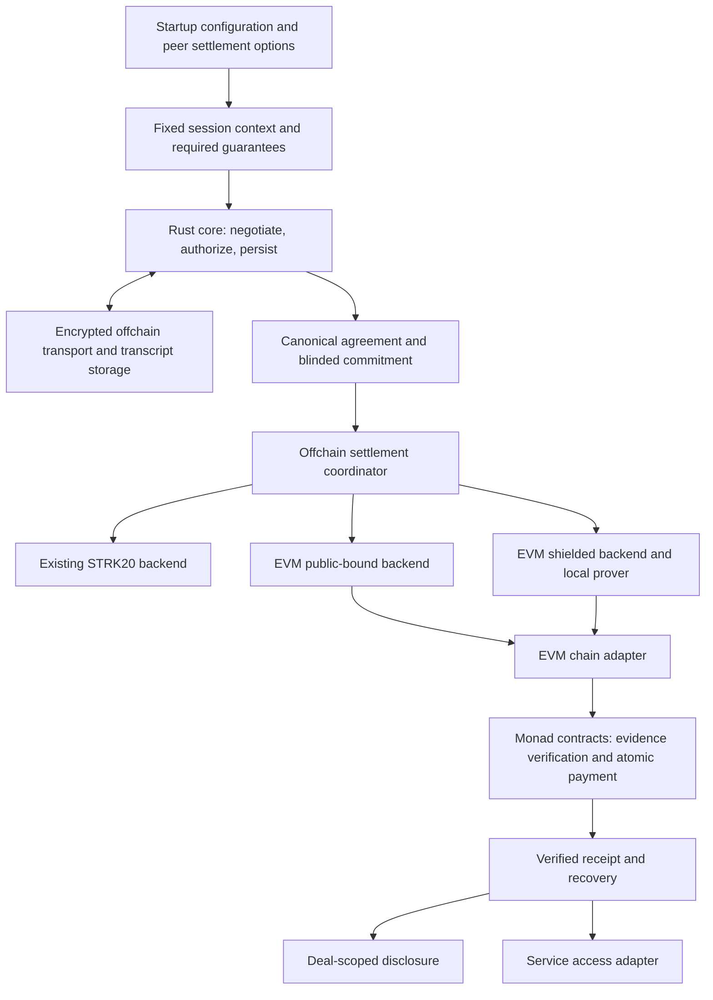

# Metropolis Implementation Roadmap

Written: 2026-09-20. Working branch: `metropolis`.
Target submission date: October 13, supplied by the project owner. Verify the portal cutoff and timezone before submission.
Status: M0 locally complete on 2026-09-20. M1-M9 remain pending.
Unchecked items are not implemented or verified by this document.

This plan covers the complete Monad implementation: Rust core, private transport, agreements, settlement contracts, proving, recovery, disclosure, and agent integration.
Codex will perform implementation and verification in subsequent work sessions. The owner reviews protocol decisions and milestone results.
Each milestone ends with a reviewable diff, test evidence, and an update to this roadmap.

Related documents: [architecture](metropolis-architecture.md), [threat model](metropolis-threat-model.md), and [demo plan](metropolis-demo-plan.md).

## Product and release target

The Metropolis goal is a developer/agent product on Monad testnet, usable by an external developer or marketplace.
Users must be able to integrate agents, discover services, negotiate privately, settle, disclose a selected deal, and recover failures.
SDK, CLI, MCP tools, packages, and operational documentation form the product surface. A frontend is not a release requirement.
An internal demonstration alone does not satisfy the final product gate.

The planning default is a complete testnet developer release. Mainnet activation remains unresolved and requires a separate release decision.
Public-bound payment is an intermediate milestone, not a substitute for the shielded-payment criteria in M5 and M9.
Payment success and service delivery have separate states. Recovery of access issuance does not guarantee an uncooperative seller will deliver.

### Hybrid operating model

All services below are planned. Users retain custody on their own machines or servers.

| Component | Default operator | Access and responsibility |
|---|---|---|
| Agent policies and negotiation | Developer or marketplace | Its own terms, budgets, and counterparty permissions |
| Keys, payment authorization, and local prover | Developer or marketplace | Private keys and witnesses remain within its environment |
| Encrypted-message relay | Optional Erebus endpoint or self-hosted service | Ciphertext, routing metadata, message sizes, and timing |
| Transaction relayer | Optional Erebus endpoint or self-hosted service | Public proofs, transaction inputs, and submission metadata |
| Pool indexer | Optional Erebus endpoint or self-hosted service | Public chain events and potentially identifying query patterns |
| Settlement contracts | Monad testnet | Enforce settlement rules under an explicitly documented administration policy |

Hosted and self-hosted deployments use the same service implementations and versioned configuration.
The client encrypts messages before transmission, authorizes locally, and verifies settlement evidence.
Hosted services must not require spending keys, plaintext negotiation content, or plaintext proof witnesses.
The local proving requirement applies to the new shielded EVM backend. It does not change existing STRK20 infrastructure trust assumptions.

Self-custody does not hide network metadata or guarantee service availability.
Operators can delay messages and submissions, observe access patterns, or return incomplete index data.
Endpoint configuration, retry behavior, backups, and provider-switch recovery must be documented and tested.
Hosted access limits, retention, health monitoring, and abuse controls are explicit operating responsibilities.

## 1. Branch discipline

- Keep all implementation, configuration, tests, and documentation changes on `metropolis`.
- Before each work session, verify the current branch and working-tree status.
- Never commit, merge, rebase, reset, or push `main` as part of this work.
- Preserve unrelated work. Review branch differences before importing any change from another branch.
- Use explicit `metropolis` destinations for authorized pushes. Do not use an implicit push destination.
- Keep deployments separate from the existing Starknet release and its state directories.
- Record the source commit for each deployment and evidence run.

Planning baseline: `metropolis` at `df86407`, already two commits ahead of local `origin/metropolis`.
The local `main` tip at planning time was `daf33efc464294a2516700cb066a98214e921a39`.
These are local observations, not a fresh remote synchronization.

## 2. Target system

The core uses backend capabilities. It does not branch on chain names throughout negotiation.
The session fixes the chain, asset, deployment, and required guarantees before authorization.
Proof generation belongs inside backends that require it. The common interface does not mandate a prover.
EVM chain access and settlement mechanisms remain separate modules. Monad is the first configured EVM deployment.

V1 provides private negotiation with contract-bound public payment. V2 adds shielded payment and private agreement verification.
Both are planned. V1 is a useful intermediate result, but it does not complete the shielded demo.
Payment finality does not guarantee delivery of an external service.

## 3. Current source map

These paths exist in the planning checkout. The extraction column describes proposed work, not existing abstractions.

| Layer | Current source | Planned treatment |
|---|---|---|
| Public API and orchestration | `sdk/rs/src/client.rs` | Separate protocol orchestration from STRK20 operations |
| Negotiation state | `sdk/rs/src/negotiation.rs` | Preserve behavior tests, then remove wire-specific dependencies from shared logic |
| Channels and wire records | `channel.rs`, `subchannel.rs`, `wire.rs` under `sdk/rs/src/` | Retain STRK20 codecs and introduce a separately versioned offchain protocol |
| Agreement authorization | Currently distributed across client, wire, and transaction signing | Add explicit canonical agreements and bilateral authorization |
| Settlement action construction | `sdk/rs/src/channel.rs`, `action_set.rs`, `actions.rs` | Keep STRK20 action building within its backend |
| Proving and submission | `execution.rs`, `calldata.rs`, `prover.rs`, `rpc.rs`, `tx.rs` | Retain Starknet execution and add EVM execution separately |
| Keys and signatures | `keys.rs`, `signer.rs`, `signing.rs`, `hashes.rs` | Separate transport, agreement, spending, and transaction key roles |
| Durable state and recovery | `state.rs`, `operation.rs`, `journal.rs`, `reconcile.rs`, `resume.rs` | Preserve request binding and isolate state by backend and deployment |
| Note discovery | `read.rs`, `decrypt.rs`, `notecache.rs` | Keep STRK20 discovery and add EVM pool event scanning |
| Disclosure | `sdk/rs/src/disclosure.rs` | Add offchain transcript packages and independently verifiable payment linkage |
| CLI and onboarding | `sdk/rs/src/bin/erebus_cli.rs`, `onboarding/` | Add explicit backend configuration and versioned commands |
| Contracts | `contracts/README.md` describes Cairo conformance probes | Add an isolated EVM contract project |
| Agent integration | `sdk/py`, `mcp-server`, `agents` | Integrate after Rust API and settlement semantics stabilize |

Verified current boundary: `channel.rs::accept_and_settle_with_change` enforces amount equality in Rust.
The `negotiation.rs` module documents client-side expiry and acceptance rules.
A successful STRK20 proof does not itself establish the new agreement predicates proposed here.

## 4. Milestones

### M0. Baseline and implementation contracts

Dependencies: none. First implementation session.

- [x] Record branch, commit, toolchains, dependencies, and existing test outcomes.
- [x] Run existing offline Rust format, lint, test, and documentation commands from CI.
- [x] Add automatic CI coverage for `metropolis` without enabling release or deployment jobs.
- [x] Audit workflow triggers so branch pushes cannot publish the existing production release.
- [x] Trace `accept_and_settle` and record which layer enforces each invariant.
- [x] Write decision records for settlement modes, replay identity, authorization, and compatibility policy.
- [x] Correct contradictions between the architecture and demo documents before freezing interfaces.
- [x] Specify hosted and self-hosted service boundaries, supported environments, metadata retention, and operational ownership.
- [x] Define the fresh-environment external integration scenario and required evidence before implementation.

Done: reproducible baseline, recorded failures, branch CI, and a source-backed boundary map.
The baseline also records product acceptance criteria and the testnet operating model.
Do not infer that the current tests pass from historical evidence.

Completed evidence: [M0 baseline](metropolis-m0-baseline.md) and [decision record](metropolis-decisions.md).
Workflow changes are locally verified but uncommitted and unpushed. Remote CI has not run for these changes.

### M1. Canonical agreement and shared Rust core

Dependencies: M0.

- [ ] Define chain namespaces, deployment domains, asset identifiers, integer amounts, and protocol versions.
- [ ] Specify exact encoding, commitment blinding, role-specific authorizations, expiry, fees, and required guarantees.
- [ ] Bind the settlement mode and required guarantees into the authorized agreement.
- [ ] Define a canonical service record: purchased resource, quantity, access recipient, and fulfillment conditions.
- [ ] Bind the service record to the agreement and distinguish payment status from delivery status.
- [ ] Specify per-deal and aggregate spending limits, permitted assets, and counterparty restrictions below the agent model.
- [ ] Define whether signed revisions share one consumed deal identity.
- [ ] Define authorization expiry and cancellation behavior without implying that local cancellation revokes onchain permission.
- [ ] Add deterministic encoding vectors, malformed-input tests, and cross-domain replay cases.
- [ ] Introduce backend capability negotiation, prepared settlement, receipt, and recovery types.
- [ ] Isolate existing STRK20 code behind its actual guarantees without changing historical state or wire formats.

Done: shared protocol logic has no Starknet `Felt` dependency and no network-name conditionals.
Existing STRK20 behavior remains covered. Unsupported privacy requirements fail explicitly.
Service-record mutations invalidate authorization. Policy-denial cases have tests independent of agent prompts.

### M2. Private offchain Eleusis

Dependencies: M1 for stable message context. Transport experiments can start during M1.

- [ ] Select an established key-agreement and authenticated-encryption implementation with a documented session protocol.
- [ ] Specify peer authentication, key roles, nonce construction, key rotation, and session recovery.
- [ ] Implement offer, counter, authorization, sequence, parent reference, and final transcript root.
- [ ] Implement a minimal ciphertext relay or direct transport with acknowledgments and durable storage.
- [ ] Bound message size, queue growth, retries, and retained transcript data.
- [ ] Reject duplicate, reordered, cross-session, and conflicting messages according to the protocol specification.
- [ ] Separate key material and confidential messages from CLI logs and model-visible output.
- [ ] Add service publication and discovery with authenticated peer identity, endpoints, assets, networks, and supported guarantees.
- [ ] Exclude private negotiations and reservation prices from public discovery records.
- [ ] Package the relay for hosted and self-hosted operation with authentication, limits, retention, and health diagnostics.

Done: two independent Rust processes agree on one transcript after disconnects and restarts.
No chain transaction is required for the new offchain negotiation path.
Transport metadata exposure is documented and measured separately from content privacy.
An external client discovers a compatible seller without receiving a seller address manually from the Erebus team.

### M3. EVM chain adapter and public-bound settlement

Dependencies: M1. This work can proceed alongside M2.

- [ ] Select and pin the Rust EVM client library and Solidity testing toolchain.
- [ ] Create the EVM contract project, deployment manifest, and generated Rust bindings.
- [ ] Implement bilateral authorization verification, domain checks, expiry, replay state, and atomic token payment.
- [ ] Bind the payment amount, asset, recipient, and fee policy to the same authorized commitment.
- [ ] Specify which settlement fields become public and which business fields remain committed and hidden.
- [ ] Define supported token behavior and reject unsupported transfer semantics.
- [ ] Implement RPC chain verification, signing, gas estimation, nonce management, submission, and receipt verification.
- [ ] Add direct-contract adversarial tests, including reentrancy and failing token transfers.
- [ ] Expose payment and network-fee estimates with explicit allowance and balance shortfalls before submission.

Done: one authorized deal pays once on a local EVM chain, with no SDK bypass for changed payment fields.
The backend explicitly declares public amounts and recipients. Public binding never masquerades as shielded settlement.

### M4. Shielded payment mechanism and proof specification

Dependencies: M1. Begin feasibility research early, alongside M2 and M3.

- [ ] Evaluate reusable privacy primitives against agreement binding, Monad deployment, licensing, and source availability.
- [ ] Select the pool integration or document why a custom pool is necessary.
- [ ] Select the proof system, circuit language, hash suite, authorization scheme, and proving-key lifecycle.
- [ ] Specify notes, ownership, membership, nullifiers, outputs, change, fees, and per-asset conservation.
- [ ] Specify the exact shared inputs between agreement verification and payment verification.
- [ ] Resolve output decryptability and seller recovery before accepting a ciphertext-digest-only design.
- [ ] Prototype one private transfer and measure proof time, memory, proof size, and verifier gas.
- [ ] Record local proving hardware requirements and reproducible installation of versioned proving artifacts.
- [ ] Publish the private witness schema and public input schema with negative test vectors.

Done: a runnable prototype demonstrates the required proof relation and a documented path to atomic contract enforcement.
A specification or two unrelated valid proofs do not pass this milestone.

### M5. Shielded contracts, prover, and note wallet

Dependencies: M4 and the EVM execution foundation in M3.

- [ ] Implement or integrate deposit, commitment tree, root history, spend nullifiers, private transfer, and withdrawal.
- [ ] Integrate agreement authorization, payment binding, range constraints, and deal replay protection into verification.
- [ ] Atomically consume the deal and input notes and create recipient and change outputs.
- [ ] Implement local witness construction and proving without sending spend secrets to the relayer.
- [ ] Implement encrypted output delivery, scanning, note selection, and restart-safe wallet storage.
- [ ] Package the public-event indexer for hosted and self-hosted operation, with rebuild and reorg recovery procedures.
- [ ] Verify wallet backup restoration and note discovery after switching indexer endpoints.
- [ ] Document setup trust, verifier versioning, upgrade authority, and artifact reproducibility.
- [ ] Run circuit mutation tests, contract fuzz tests, and independent conservation properties.

Done: deposit -> private negotiated payment -> recipient discovery -> recipient spend or withdrawal works end to end.
Wrong amount, asset, recipient, domain, proof, or replay cannot change contract state.
The recipient can restore state and withdraw test funds using documented commands and locally held secrets.

### M6. Coordinator, relayer, and recovery

Dependencies: M1 and M3. Extend the same lifecycle to M5.

- [ ] Resolve the backend once from session configuration and verify both peers accept the same settlement context.
- [ ] Persist canonical intent before signing, proving, or submitting.
- [ ] Separate prepared, submitted, unknown, included, finalized, reverted, and expired outcomes.
- [ ] Bind relayer compensation and prevent copied submissions from redirecting value.
- [ ] Handle concurrent calls, nonce replacement, RPC disagreement, dropped responses, and reorgs.
- [ ] Reconcile from transaction and contract evidence before resubmission.
- [ ] Keep journal migrations explicit and isolate note reservations across operations.
- [ ] Enforce spending policies before authorization, with concurrent reservations and reconciliation of uncertain payments.
- [ ] Add redacted operation diagnostics, health metrics, and runbooks for relay, relayer, indexer, and RPC failures.
- [ ] Package the relayer with explicit fee funding, access limits, and provider-switch recovery.

Done: fault injection after every durable boundary yields at most one payment and a recoverable operation state.
Test both settlement modes. A local timeout never becomes evidence of an unpaid deal.
Policy limits survive concurrent requests and restarts. Operators can diagnose stalled operations without exporting private keys or transcripts.

### M7. Scoped disclosure

Dependencies: M2, M6, and the relevant settlement backend.

- [ ] Define a recipient-bound package containing transcript evidence, agreement opening, authorizations, and settlement evidence.
- [ ] Provide issuer authentication and independent receipt verification.
- [ ] Export only per-deal capabilities, never parent session keys or spending secrets.
- [ ] Implement explicit transcript backup and availability behavior.
- [ ] Test wrong recipients, altered evidence, neighboring deals, and missing relay data.
- [ ] Document backup and restoration of disclosure evidence without a dependency on hosted relay retention.

Done: a third process verifies the selected agreement and payment without either participant being online.
Document that expiry and revocation cannot erase plaintext already disclosed.

### M8. Monad deployment and agent integration

Dependencies: M2, M6, M7. Full private demonstration also requires M5.

- [ ] Verify current Monad network parameters and chosen verifier support against official sources and live RPC behavior.
- [ ] Deploy to testnet with reproducible artifacts, configuration, and verified contract identities.
- [ ] Add CLI onboarding, funding diagnostics, backend selection, and receipt output.
- [ ] Publish versioned testnet packages and a fresh-install guide covering identity, discovery, funding, settlement, disclosure, recovery, and withdrawal.
- [ ] Deploy optional shared testnet services and document their metadata exposure, retention, access limits, and availability behavior.
- [ ] Provide a self-hosting package using the same service implementations, with endpoint configuration and persistent storage instructions.
- [ ] Update the Python boundary, MCP configuration, and deterministic two-agent harness.
- [ ] Add the HTTP service adapter and bind access to the finalized agreement and intended buyer.
- [ ] Persist access-issuance state and retry interrupted delivery without repeating payment or granting access to another buyer.
- [ ] Expose paid-but-undelivered outcomes and document the seller cooperation required for recovery.
- [ ] Implement x402 composition only against a specified scheme, with exactly one payment and explicit privacy exposure.
- [ ] Measure negotiation, proof, submission, inclusion, finality, and service delivery separately.

Done: independent buyer, seller, observer, and disclosure processes complete the real Monad workflow.
Both hosted endpoints and the self-hosting package support the documented workflow.
An interrupted service response can recover access without a second charge.
Mainnet deployment is a separate release decision after review and testnet evidence.

### M9. Hardening and submission

Dependencies: M0-M8 for the complete target.

- [ ] Run the threat-model attack matrix through direct contracts and SDK calls.
- [ ] Run existing Starknet regression tests and new EVM, circuit, transport, and recovery suites.
- [ ] Audit public calldata, logs, RPC payloads, relay metadata, and output shape for the stated privacy claims.
- [ ] Rehearse from a fresh environment and archive sanitized, reproducible evidence.
- [ ] Have an external developer integrate their agents using only versioned packages and public documentation, without undocumented team intervention.
- [ ] Require discovery, shielded settlement, scoped disclosure, interrupted-operation recovery, and withdrawal in that external run.
- [ ] Rehearse self-hosting, backup restoration, and endpoint switching from a separate fresh environment.
- [ ] Record installation friction, policy-denial tests, metadata exposure, and service-failure diagnostics with the release evidence.
- [ ] Record the demo with real timings and clearly labelled edits.
- [ ] Separate prior Erebus work from development completed during Metropolis.
- [ ] Verify portal requirements, deadline timezone, mentor feedback, and any selected sponsor criteria.
- [ ] Prepare the submission package and document remaining limitations and review status.

Done: every submission claim points to code, a reproducible test, or a dated chain artifact.
The final product gate requires the external integration run and the self-hosting rehearsal above.
If no external developer completes the run, record the gate as incomplete even when internal demonstrations pass.
Any unfinished milestone remains explicitly unfinished. The schedule does not redefine completion.

## 5. Execution sequence and dates

Dates are planning targets, not estimates supported by implementation measurements.
Keep the complete scope visible and update forecasts after the first proof and contract measurements.

| Target window | Primary work | Work that can proceed alongside it |
|---|---|---|
| Sep 20-22 | M0 baseline and M1 protocol decisions | M4 privacy primitive and verifier feasibility |
| Sep 23-26 | M1 core, M2 transport, M3 public-bound settlement | M4 proof prototype |
| Sep 27-Oct 2 | M5 private settlement and M6 recovery | M7 disclosure package |
| Oct 3-7 | M8 Monad and agent integration | M9 adversarial tests and observer evidence |
| Oct 8-10 | Full-system regression and fresh-environment rehearsal | Submission evidence and demo recording |
| Oct 11-13 | Repairs, final evidence, and submission | Verify portal cutoff before the final day |

Critical dependency: agreement specification -> constrained private payment -> atomic verifier/pool transition -> recoverable Monad run -> evidence.
Public-bound settlement can progress independently of proving work, but it cannot satisfy the private settlement completion criteria.

## 6. First implementation session

1. Verify `metropolis` and record the current source baseline.
2. Run the existing Rust CI commands and classify failures before editing protocol code.
3. Enable branch CI and verify that release workflows remain isolated.
4. Write the agreement schema and backend capability decision record.
5. Add canonical encoding and domain/replay tests as the first new Rust behavior.
6. Begin the private settlement feasibility prototype against that same agreement schema.

Use existing modules first. Introduce separate crates only where dependency isolation or independent testing requires them.
Candidate boundaries are core, transport, settlement coordination, STRK20, EVM, and disclosure.
The final module layout follows the inspected dependency graph, not this list alone.

## 7. After Metropolis

- Qualify the generic EVM backend on another chain with independent deployment and finality tests.
- Improve Starknet agreement enforcement without claiming parity from an adapter wrapper alone.
- Add further privacy mechanisms behind explicit capabilities and trust assumptions.
- Evaluate chain negotiation, cross-chain settlement, escrow, and service-delivery guarantees as separate protocol extensions.
- Obtain external security review before a production-value launch.

## Progress log

| Date | Completed | Evidence |
|---|---|---|
| 2026-09-20 | Roadmap and branch isolation for planning | Switched from clean `main` to existing `metropolis` before edits |
| 2026-09-20 | M0 local completion | [Baseline, enforcement map, workflow audit](metropolis-m0-baseline.md), and [decisions](metropolis-decisions.md) |

M0 is complete locally. No M1-M9 implementation milestone is complete.
