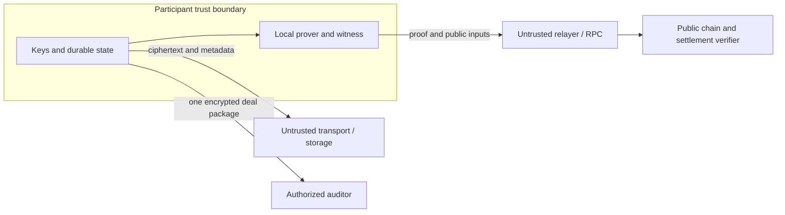

# Erebus Metropolis Threat Model

Status: proposed requirements, 2026-09-14. No EVM security guarantees are verified by this document.
Read the [architecture](metropolis-architecture.md) first.
The existing Starknet deployment retains its [current privacy model](privacy-model.md).

## 1. Assets and adversaries

Protect shielded funds, spend keys, negotiation contents, agreement integrity, and deal-scoped disclosure keys.
Consider a malicious counterparty, relay, relayer, RPC, indexer, prover operator, and public chain observer.
An attacker can bypass the SDK and call contracts directly.
A compromised agent host can read its plaintext and keys. Protocol encryption does not protect that host from itself.

The baseline keeps proof witnesses local. The existing Starknet path exposes pool keys to its
configured proving and preflight endpoints; this draft does not remove that exposure.
Prover placement is a separate decision from whether a circuit exists. Local proving keeps the
witness on the participant host and is the baseline. A remote prover that receives plaintext
witnesses becomes a trusted party and must see no more than the guarantee requires. A
client-side or WASM prover is a later option whose feasibility depends on the proving system,
not on this interface. Alternative backends must declare their trust assumptions and guarantees.
The common interface does not require a prover or assume that a TEE and a private rollup provide equivalent security.

## 2. Visibility targets

These are Architecture C targets, conditional on the selected privacy rail and proof implementation.

| Observer | Visible | Intended hidden |
|---|---|---|
| Public chain reader | Contract, relayer, commitments, nullifiers, roots, timing, transaction shape, public expiry and fees | Negotiation, private payment amount and recipient |
| Public-bound EVM settlement (V1) | Amount, recipient, asset, and timing | Negotiation and unshared terms |
| Deposit/withdrawal observer | Public token transfers, amounts, accounts, timing | Direct mapping to later private notes |
| Transport operator | Endpoints or mailbox identifiers, sizes, timing, availability | Message plaintext |
| Relayer and RPC | Public settlement envelope and submission metadata | Witness, participant keys, private terms |
| Counterparty | Its negotiation and agreed terms | Other deals and spending secrets |
| Auditor with one grant | Selected transcript, opening, authorizations, payment evidence | Other deal keys and spending authority |

Token identity can remain public through pool selection. A small anonymity set can make amount and timing correlations strong.
Removing public channel opening can reduce direct relationship disclosure. Relaying alone does not prove relationship privacy.
An observer can correlate deposits, withdrawals, endpoints, and timing even when ciphertext remains secure.
For paid APIs, repeated per-request settlements can reveal which service an agent uses, how often
it uses it, and activity patterns from which an observer may infer strategy. Prepaid or batched
settlement can reduce onchain frequency but does not hide requests from the service, transport
metadata from network operators, or the timing and size of each published batch.

## 3. Required attack tests

| Attack | Required defense | Acceptance test |
|---|---|---|
| Guess the hidden price | Fresh random commitment blinding | Dictionary of likely terms cannot reproduce the commitment without its blinding |
| Substitute terms or authorizations | Canonical encoding, role tags, domain binding | Mutate each field and swap roles; verification fails |
| Pay less or redirect payment | Proof binds amount, asset, and recipient to the agreement | Direct contract call with each changed output fails |
| Mint through overflow | Range constraints and per-asset conservation | Boundary, overflow, and mixed-asset witnesses fail |
| Replay a deal with fresh funds | Deterministic authorized deal nullifier | Same agreement with different input notes cannot settle twice |
| Spend a note twice | Pool note nullifiers | Concurrent spends produce at most one successful transition |
| Replay on another chain or deployment | Domain in commitment, authorization, proof, and contract checks | Wrong chain, pool, verifier version, or contract fails |
| Mix valid unrelated proofs | Shared constrained payment commitments | Agreement proof A plus payment proof B fails |
| Downgrade a required guarantee | Requirement-to-backend check before submission | A deal requiring hidden amount cannot select a public settlement backend |
| Steal relayer fees or front-run | Bound fee and recipient policy | Modified fees fail; copied submission cannot redirect value |
| Commit unusable payment ciphertext | Output encryption correctness or recipient acknowledgment | Seller decrypts and can spend every accepted output |
| Forge or reorder messages | Peer authentication, sequence, parent hash, signed final root | Duplicate, forked, cross-session, and missing-parent messages are rejected |
| Settle an expired agreement | Contract time check bound to authorized expiry | Submission after expiry reverts |
| Retry after lost response | Durable operation intent and chain reconciliation | Kill after broadcast; restart without a second payment |
| Fake indexer receipt | Independent chain evidence and finality verification | Fabricated event or orphaned block cannot mark a deal finalized |
| Broaden disclosure | Independent deal keys and recipient encryption | Wrong recipient and adjacent deal remain unreadable |
| Infer agent behavior from paid API traffic | Prepaid or batched settlement where compatible, plus an explicit metadata report | Compare per-request and aggregate public traces; record which service, timing, frequency, and batch information remains inferable |

A dictionary test is a regression check, not a cryptographic proof of commitment hiding.
Failure of one observer attack does not establish anonymity against every observer.

## 4. Authorization and cancellation

An authorization gives bounded payment permission. It does not reserve funds or force a party to submit.
A new counteroffer does not invalidate an earlier signed revision. All revisions share one consumed deal identity under M0 D02.
An offchain cancellation cannot revoke a proof that the chain still accepts.
Until a cancellation mechanism exists, treat signed permission as usable until expiry or settlement.
Do not present local cancellation as onchain revocation.
Signature-based authorization for an EVM backend reveals the signer when recovered. Where the
deal requires hidden parties, authorization must be proven rather than recovered, so a
public-signature V1 and a private V2 differ in the authorization mechanism as well as in the
payment. EIP-712 provides typed signing and no replay protection on its own.

The contract must verify the settlement domain itself. A prover-supplied domain is insufficient.
Verifier upgrades and pool administration affect these guarantees. Document their authority before deployment.

## 5. Disclosure and data availability

Offchain transcripts need durable storage. A commitment cannot reconstruct missing messages.
The disclosure package includes selected messages, their authentication, the agreement opening, both authorizations, and matching settlement evidence.
Encrypt the package to the auditor and authenticate its issuer where issuer identity is claimed.
The auditor verifies the transcript root, commitment opening, authorizations, and payment linkage independently.

A grant must contain neither parent session keys nor spending secrets.
Grant expiry is an application access rule. It cannot erase a decrypted copy or prevent its recipient from sharing plaintext.
Revocation also cannot retract information already disclosed.
An authenticated transcript proves the included statements and their binding, not their truth or completeness outside the agreed root.

## 6. Atomicity and operational limits

Atomicity covers settlement state: deal consumption, input consumption, and output creation succeed together or revert together.
It does not cover delivery of an external API response, dataset, or compute job.
A seller can receive payment and withhold service. Escrow, dispute resolution, and cryptographic fair exchange require separate designs.

RPC and relay failures can delay settlement. A relayer must never need a participant's spending key.
LLM prompts, tool responses, telemetry, and crash logs can leak terms despite correct encryption.
Keep secrets out of public demo logs and provide an explicit private operator view.
Use budgets and role permissions at the agent boundary, but enforce payment authorization independently in settlement.

## 7. Evidence required before claims

Record the circuit and verifier versions, dependency revisions, deployed addresses, and all public inputs.
Run the attack tests against direct contract calls as well as SDK calls.
Separate local tests, live testnet evidence, and external review in reports.
Unaudited prototype evidence does not establish production readiness.
Any public-payment fallback must identify exposed amounts and recipients and must not claim Architecture C settlement privacy.
Every backend must report its verified guarantee set, and a demo must state which guarantees
were actually enforced rather than which were intended.
