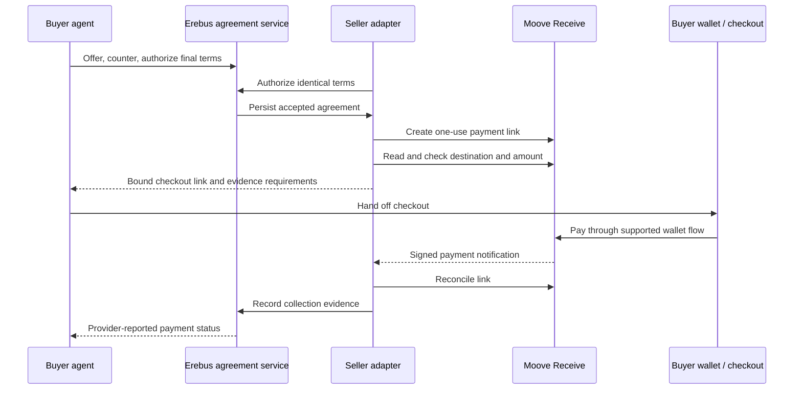

# Moove integration plan

Status: implementation proposal. No integration code or live payment was run for this plan.
Research date: 2026-09-21. Source baseline: `daf33ef`.
Work branch: `moove_agentic_payments`, created from the existing `moove-agentic-payments` branch.

The first deliverable is an Erebus agreement followed by Moove payment collection.
The buyer pays through hosted checkout. Autonomous payment execution depends on a future Send API.
Moove collection does not provide shielded settlement or atomic acceptance and payment.

## 1. Evidence and boundaries

The following facts come from current public documentation. Authenticated API behavior remains untested.

| Surface | Documented behavior | Consequence |
| --- | --- | --- |
| Receive | Create, list, and publicly retrieve payment links | A seller can request payment and reconcile collection |
| Destination | The API key owner's default wallet determines the destination, chain, and token | Each seller needs its own account configuration and credentials |
| Creation | Returns only `id` and `url` | Read the link before presenting checkout |
| Amount | `toAmount` accepts decimal strings in the destination token | Convert from integer units without floating point |
| Link controls | `maxUsage` and `expirationDate` are optional | Explicitly set one use and the agreement deadline |
| Public retrieval | Exposes payment details and the owner's profile | Keep confidential terms out of link descriptions |
| List | Ten records per page, with `nextOffset` | Reconciliation must follow pagination |
| Deactivation | Requires the dashboard | A local cancellation cannot disable a payable link |

Source: [Payment Links API](https://docs.moove.xyz/api-reference/moove-receive/moove-payment-links.md).

Moove documents signed webhooks for successful transactions and completed links.
Events can repeat or arrive out of order. Completion can mean the usage cap was reached.
The source transaction hash can belong to another chain. Its source chain is absent.
Webhook registration requires the console. Expiry and deactivation produce no events.
Source: [Webhooks](https://docs.moove.xyz/api-reference/moove-receive/webhooks.md).

Send remains unavailable through the public API.
The current Agentic Payments product teaches coding tools to integrate Receive.
These facts do not establish a contradiction with a claim that Receive is live.
Source: [Moove Agentic Payments](https://docs.moove.xyz/transact/moove-agentic-payments).

Starknet and Monad do not appear in the current supported-chain list. Base does appear.
This absence does not establish future support or private program access.
Source: [Supported Blockchains](https://docs.moove.xyz/platform-support/supported-blockchains.md).

The pasted footer alone cannot establish that a product works.
This plan does not assume grant eligibility, binding program terms, or access to an unreleased API.

## 2. What must change in Erebus

| Existing source | Observed behavior | Required work |
| --- | --- | --- |
| [`client.rs`](../sdk/rs/src/client.rs), `accept_and_settle` | Selects STRK20 notes and executes payment with acceptance | Introduce a separate agreement operation for external collection |
| [`negotiation.rs`](../sdk/rs/src/negotiation.rs), `OfferBook::record` | An `Accept` message records settlement | Keep accepted and paid separate in the new lifecycle |
| [`client.rs`](../sdk/rs/src/client.rs), `OfferTerms` | Uses a Starknet `Felt` token and `u128` amount | Add explicitly namespaced assets for external agreements |
| [`journal.rs`](../sdk/rs/src/journal.rs) | Stages include proving, signing, and chain submission | Give collection its own durable stages |
| [`operation.rs`](../sdk/rs/src/operation.rs) | Defines stable operation IDs and request binding | Preserve the retry contract across collection operations |
| [`interface.py`](../mcp-server/src/erebus_mcp/interface.py) | Mirrors the current atomic settlement interface | Add separate collection results and errors |
| [`config.py`](../mcp-server/src/erebus_mcp/config.py) | Supports `mock` and `seam` | Separate execution mode from collection-provider configuration |

The [Metropolis architecture](metropolis-architecture.md) already proposes independent coordination, agreements, and settlement capabilities.
It remains a design document. Its offchain transport and generic agreement model are not implemented by the inspected path.

Inference: Moove requires agreement extraction, not only an HTTP adapter.
Evidence: the existing `Accept` changes settlement state, while checkout can remain unpaid after acceptance.

## 3. Proposed scope and decisions

The proposed first pilot uses one seller, one buyer, and one fixed destination asset.
Base USDC is a candidate, subject to the seller's actual Moove configuration and API evidence.
The pilot starts with explicit peer identities and endpoints. A discovery marketplace is outside its scope.

These implementation decisions remain yours. Record each choice and your reasoning before its dependent phase.

| Decision | Mechanisms to examine | Dependency |
| --- | --- | --- |
| Negotiation transport | Existing STRK20 note transport, or new authenticated offchain transport | Phase 2 |
| Agreement authorization | Canonical encoding, role signatures, key registration, and replay rules | Phase 2 |
| Evidence requirement | Provider-reported collection, or independent destination-chain evidence | Phase 4 and release claims |
| Pilot payment terms | Exact amount, fees, deadline interpretation, and third-party payment policy | Phases 2–4 |
| Durable storage | Separate collection records, locking, and crash-safe updates | Phase 1 |

Existing note transport requires Starknet infrastructure and cannot express an EVM token by pretending it is a Starknet token.
An offchain transport requires peer authentication, encryption, ordering, retransmission, and durable transcripts.
Both routes need explicit external agreement semantics. Neither route can reuse atomic `Accept` unchanged.
No transport choice is silently settled by this plan.

## 4. Target behavior



The agreement binds version, session, deal, revision, buyer, seller, destination, asset, integer amount, deadline, fees, and terms digest.
It also binds the selected provider and required guarantees.
Both parties authorize the same canonical bytes. A payment link is attached afterward to that fixed agreement.
The seller authenticates the attachment. The buyer checks its fields before checkout.
An opaque random reference connects the link to local records. It reveals no business terms.

Proposed guarantee declarations:

| Guarantee | Moove Receive pilot |
| --- | --- |
| Confidential negotiation | Depends on the chosen and tested Erebus transport |
| Private settlement amount or recipient | No |
| Atomic agreement and payment | No |
| Contract-enforced agreement | No |
| Autonomous payer execution | No |
| Provider-reported collection | Yes, after evidence checks |
| Independently verified destination finality | Unavailable until sufficient evidence exists |

A request for unsupported guarantees fails before link creation.
Existing `accept_and_settle` keeps its STRK20 meaning and receipt format.
Moove never returns fabricated nullifiers, proof times, or shielded receipts.

## 5. Delivery phases

### Phase 0 — Freeze the external contract

- Capture the current documentation URLs and retrieve the published OpenAPI schema.
- Compare the schema with the documented request and response fields.
- Obtain a seller-owned key through the dashboard for the live pilot.
- Record the intended wallet, asset address, chain, decimals, and account identity outside prompts.
- Ask Moove the questions in section 8.

Exit: reviewed fixtures and an explicit list of undocumented behavior.
Mocks can proceed without credentials. A live milestone cannot pass through mocks.

### Phase 1 — Implement the Receive adapter and durable records

Proposed new Rust modules: `sdk/rs/src/moove/{mod,client,types,store}.rs`.
Existing `reqwest`, `serde`, and Tokio dependencies provide the HTTP foundation.

- Implement create, retrieve, and paginated list calls against the documented API.
- Keep the API key in server configuration and redact it from errors and logs.
- Disable credential forwarding through redirects and reject unexpected checkout hosts.
- Scope records by seller account, agreement, operation ID, and provider link ID.
- Persist intent before POST and persist the returned link before exposing it.
- Reject reuse of an operation ID with changed parameters.
- Serialize creation for one agreement across concurrent processes.
- Convert integer amounts to decimal strings with explicit precision and range checks.
- Read the created record and compare destination, asset, amount, usage cap, and expiry.

No documented create-idempotency mechanism was found in the inspected Payment Links page.
A timeout after POST therefore means `CreationUnknown`, not permission to create another link.
Recovery searches all pages for the opaque reference and checks every bound field.
Zero or multiple matches remain unresolved. A list miss does not prove creation failed.
The adapter must not issue another POST automatically in that state.

Exit: deterministic HTTP fixtures cover successful creation, ambiguous creation, pagination, mismatches, and concurrent retries.

### Phase 2 — Separate agreement acceptance from payment

Proposed new modules: `sdk/rs/src/agreement.rs` and `sdk/rs/src/collection.rs`.
Transport placement depends on your section 3 decision.

- Define canonical agreement bytes and cross-language test vectors.
- Bind identities, destination, asset, fees, deadline, provider, and revision into authorization.
- Define whether a newer revision invalidates an older authorized revision.
- Implement acceptance without spending STRK20 notes or recording a settlement.
- Add capability checks before authorization and collection creation.
- Add authenticated attachment of the provider link to the accepted agreement.
- Keep legacy wire decoding and STRK20 behavior compatible.

If offchain transport is selected, this phase also implements its complete session protocol.
The work includes authenticated peer keys, message sequence rules, replay rejection, expiry, reconnects, and transcript recovery.
Existing STRK20 channel keys and disclosure packages are not automatically portable.

Exit: two independent clients agree on identical terms and reject changed recipients, prices, revisions, or providers.
Acceptance alone never produces a paid result.

### Phase 3 — Expose the collection workflow

Proposed API operations: `accept_agreement`, `create_collection`, `read_collection`, and `reconcile_collection`.
These names are provisional additions, not aliases for `accept_and_settle`.

Affected surfaces:

- `sdk/rs/src/bin/erebus_cli.rs`: request dispatch, version negotiation, and typed errors.
- `sdk/py/src/erebus/_seam.py`: subprocess binding for the new operations.
- `mcp-server/src/erebus_mcp/interface.py`: agreement and collection result types.
- `mcp-server/src/erebus_mcp/{config,tools,seam_client,mock_client}.py`: configuration, tool access, and matching mock behavior.
- `mcp-server/src/erebus_mcp/onboarding.py`: mode-specific readiness requirements.
- `.env.example` and `docs/reference.md`: configuration and guarantee descriptions.

Proposed configuration includes `MOOVE_API_KEY` and an explicit expected destination and asset.
Collection creation runs only under the seller's configured identity.
Buyer-facing tools expose the checked URL and payment status, never the seller's credentials.
Every response identifies mock versus live execution and its evidence level.

Exit: two MCP clients complete negotiation and receive checkout instructions without a false settlement result.
Protocol compatibility tests reject unsupported operations on older binaries.

### Phase 4 — Reconcile and recover payment state

Polling provides the initial recovery path. Webhooks require a separately reachable HTTPS service.
The current stdio MCP process does not become a public webhook server automatically.
The service persists events for the same collection worker that performs polling reconciliation.

Proposed states:

```text
AgreementAccepted -> CreatingLink -> AwaitingPayment -> ReportedPaid
                         |
                         +-> CreationUnknown -> reconciliation

Any unresolved discrepancy -> NeedsAttention
AwaitingPayment -> ExpiredUnpaid or CancelledLocally
ReportedPaid -> ChainVerified only with independent destination evidence
```

Expiry and local cancellation do not prove that no payment is in flight.
Late payments remain visible and enter review. Refunds require a separate authorized workflow.
A Moove payment never triggers a second STRK20 payment to complete the same deal.

Payment checks compare the bound destination, chain, token, requested amount, and received amount.
The pilot requires exact payment. Underpayment, overpayment, or changed wallet configuration enters review.
A `completed` link alone is insufficient evidence of the agreed amount.
Provider evidence cannot establish the payer's identity. Third-party payment policy must be explicit.
Fulfillment records use one durable claim per agreement to prevent duplicate delivery.

For webhooks, authenticate raw bytes before parsing and persist the event before acknowledgment.
Use HMAC-SHA256 over timestamp, a period, and the raw body, with the complete signing secret.
Reject malformed or stale timestamps and compare signatures in constant time.
Deduplicate endpoint event IDs and provider transaction IDs across overlapping endpoints.
Treat cumulative received amounts as snapshots, not increments. Reconcile conflicting or older observations.
Source: [Webhook authentication and delivery](https://docs.moove.xyz/api-reference/moove-receive/webhooks.md).

Read retries use bounded exponential backoff with jitter and shared outbound-IP budgeting.
Ambiguous POST creation follows the stricter recovery rule in Phase 1.
Source: [Rate Limits](https://docs.moove.xyz/api-reference/rate-limits.md).

Exit: restarts, missed events, repeated events, and reordered events cannot create duplicate links or fulfillment.

### Phase 5 — Run a bounded live demonstration

- Configure one seller account and the agreed destination asset.
- Negotiate one deal between two separately identified clients.
- Create and inspect one payment link.
- Complete checkout with an explicitly authorized payment amount.
- Reconcile the actual collection and retain redacted evidence.
- Restart the integration and recover the same agreement and link.
- Record the observed evidence level and the manual checkout step.

The evidence bundle includes version, configuration fingerprint, agreement digest, link reference, and redacted responses.
Any chain-verification claim needs destination transaction evidence and an explicit finality policy.
The public demo excludes keys, confidential terms, and unapproved account identifiers.

Exit: a reproducible negotiated collection demo. No autonomous-payment or private-settlement claim.

### Phase 6 — Add autonomous Send only after access exists

This phase depends on a documented or program-provided execution interface.
It requires signing rules, supported assets, fee limits, idempotency, status lookup, and finality behavior.
The buyer must enforce recipient, asset, amount, expiry, and budget policy before authorization.
Send must satisfy the existing collection or replace its payment path explicitly.
It must never pay the seller twice through independent Send and checkout flows.

Exit: an authorized agent executes one payment and recovers safely after an ambiguous submission.
No delivery date is assigned before the API contract and access exist.

## 6. Required tests and checks

| Area | Failure cases |
| --- | --- |
| Agreement | Different canonical bytes, stale revision, wrong signer, expiry, unsupported guarantees |
| Amount | Fractional precision, overflow, negative input, zero, and no floating-point conversion |
| Ownership | Wrong account, recipient substitution, chain mismatch, token mismatch, changed default wallet |
| Creation | Crash before POST, lost response, crash before local save, concurrent calls, duplicate matches |
| Reads | More than ten links, shifting pages, unknown statuses, null fields, 401, 403, 409, 422, 429, 5xx |
| Payment | Completed but underpaid, excess payment, late payment, cancellation race, unknown payer |
| Webhooks | Wrong signature, modified bytes, stale timestamp, duplicate IDs, reordered events, endpoint replacement |
| Recovery | Lost webhook, restart, stale API state, unavailable evidence, duplicate fulfillment attempt |
| Compatibility | Existing STRK20 negotiation, settlement, disclosure, journal recovery, CLI and MCP behavior |

The repository has no Makefile in the inspected file inventory.
The implementation checks follow [CI](../.github/workflows/ci.yml):

```bash
cargo fmt --manifest-path sdk/rs/Cargo.toml --check
cargo clippy --manifest-path sdk/rs/Cargo.toml --all-targets -- -D warnings
cargo test --manifest-path sdk/rs/Cargo.toml --all-targets
RUSTDOCFLAGS="-D warnings" cargo doc --manifest-path sdk/rs/Cargo.toml --no-deps
cargo build --manifest-path sdk/rs/Cargo.toml --bin erebus-cli
uv sync --all-packages
uv run pytest -rs
git diff --check
```

A passing mock suite does not establish live API compatibility.
Live checks require configured credentials and a separately authorized payment.
This document-only change does not require these implementation suites.

## 7. Milestones and dependency order

| Milestone | Includes | Completion evidence | External dependency |
| --- | --- | --- | --- |
| M1: Receive adapter | Phases 0–1 | Contract fixtures and crash-recovery tests | Docs for mocks, seller credentials for live checks |
| M2: Negotiated collection | Phases 2–3 | Two-client transcript and checked checkout link | Your transport and authorization decisions |
| M3: Reliable collection | Phase 4 | Payment checks, event replay tests, restart recovery | Console access only for live webhooks |
| M4: Live demonstration | Phase 5 | Redacted live evidence and reproducible procedure | Seller setup and authorized checkout payment |
| M5: Autonomous execution | Phase 6 | One actual agent-submitted payment with recovery | Send API contract, access, and signing model |

Phase 1 can use agreement fixtures before Phase 2 completes.
Real agreement-to-payment integration requires both phases.
Independent chain verification remains a separate acceptance condition until the missing evidence is available.
These are technical milestones, not grant commitments or delivery estimates.

## 8. Questions for Moove

1. Does create support idempotency or lookup by a caller-supplied reference?
2. Does a link retain its original destination after the owner changes the default wallet?
3. Can API clients retrieve the source chain, destination transaction hash, and finality status?
4. What does `receivedAmount` measure relative to routing fees and the recipient's actual balance increase?
5. Can single-use links complete with an underpayment or remain payable during concurrent checkout sessions?
6. How do expiry, in-flight routing, reorgs, and refunds affect status and webhook delivery?
7. Is a sandbox available, and what are the actual per-key and per-IP limits?
8. What is the Send API access timeline and signing model for program participants?
9. Can program participants inspect a Send specification under NDA before committing a dependent milestone?
10. Which binding program terms define milestones, missed delivery, and reporting obligations?

## 9. First implementation session

Read `OfferBook::record` in [`negotiation.rs`](../sdk/rs/src/negotiation.rs) first.
Identify the exact statement that turns acceptance into settlement.
Then explain what state must exist between agreement acceptance and Moove payment.
That answer starts Phase 2's state model. Implementation proceeds one bounded source change at a time.
